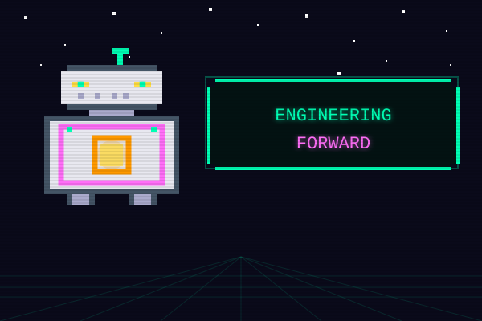

## Weekly recap and analyses
Get the weekly recap and deeper analyses at https://engineeringforward.substack.com.

## Statistics

Articles per month:

2022-12 | █ 2 
2023-10 | █ 1 
2024-05 | █ 1 
2024-06 | █ 2 
2024-12 | █ 1 
2025-04 | █ 1 
2025-05 | █ 3 
2025-06 | █ 1 
2025-07 | █ 2 
2025-08 | █ 1 
2025-09 | █ 2 
2025-10 | ██ 4 
2025-11 | █ 2 
2025-12 | █ 3 
2026-01 | ██████████████████████████████████ 102 
2026-02 | ██████████████████████████████████████████████████ 149 
2026-03 | █████████████████████████████████████████████████████████████████████████████████████████████████████████████████████████████ 374 
2026-04 | █████████████████████████████████████████████████████████████████████████████████████████████████████████████████████████████████████████████████████████████████████████████████████████████████████████ 603 
2026-08 | █ 1
## Articles

### 2026

#### August (1 article)
- [11 AI agent startups to watch, according to investors](src/2026-08/20250804-11-ai-agent-startups-to-watch-according-to-investors.md)

#### April (603 articles)
- [Agent Lightning: Framework-Agnostic AI Agent Training and Optimization](src/2026-04/20260618-agent-lightning-framework-agnostic-ai-agent-training.md)
- [Awesome LLM Apps: A Collection of RAG, AI Agents, Multi-agent Teams, MCP, and Voice Agents](src/2026-04/20260429-awesome-llm-apps-collection-rag-agents-mcp.md)
- [What Elon Musk and OpenAI's High-Profile Court Case Is Actually About](src/2026-04/20260428-what-elon-musk-and-openai-s-high-profile-court-case-is-actually-about.md)
- [🎙️ This week on How I AI: GPT 5.5, Claude Design, and GPT Images 2.0 hands-on reviews—plus an inside look at Memelord](src/2026-04/20260428-this-week-on-how-i-ai-gpt-5-5-claude-design-and-gpt-images-2-0-hands-on-reviewsplus-an-ins.md)
- [Slack for AI Employees](src/2026-04/20260428-slack-for-ai-employees.md)
- [Scaling Test-Time Compute for Agentic Coding](src/2026-04/20260428-scaling-test-time-compute-for-agentic-coding.md)
- [How to Run a 24/7 AI Agent that Grows with You](src/2026-04/20260428-how-to-run-a-24-7-ai-agent-that-grows-with-you.md)
- [How Stripe Detects Fraudulent Transactions Within 100 ms](src/2026-04/20260428-how-stripe-detects-fraudulent-transactions-within-100-ms.md)
- [How Amazon Uses LLMs to Recommend Products](src/2026-04/20260428-how-amazon-uses-llms-to-recommend-products.md)
- [GitHub - stainlu/hermes-labyrinth](src/2026-04/20260428-github-stainlu-hermes-labyrinth.md)
- [GitHub - Shubhamsaboo/awesome-llm-apps: 100+ AI Agent & RAG apps you can actually run — clone, customize, ship.](src/2026-04/20260428-github-shubhamsaboo-awesome-llm-apps-100-ai-agent-rag-apps-you-can-actually-run-clone-cust.md)
- [GitHub - openclaw/clawsweeper: ClawSweeper scans all issues and PRs and suggest what we can close, and why. It runs every PR / Issue once a week.](src/2026-04/20260428-github-openclaw-clawsweeper-clawsweeper-scans-all-issues-and-prs-and-suggest-what-we-can-c.md)
- [GitHub - nex-crm/wuphf: Slack for AI employees that build and maintain their own wiki. Get Claudes, Codexes, OpenClaws and local LLMs to collaborate and do your work autonomously while never losing context.](src/2026-04/20260428-github-nex-crm-wuphf-slack-for-ai-employees-that-build-and-maintain-their-own-wiki-get-cla.md)
- [GitHub - alash3al/stash: Stash — persistent memory layer for AI agents. Episodes, facts, and working context stored in Postgres. MCP server included. Self-hosted, single binary, no cloud required.](src/2026-04/20260428-github-alash3al-stash-stash-persistent-memory-layer-for-ai-agents-episodes-facts-and-worki.md)
- [Efficient Video Intelligence in 2026](src/2026-04/20260428-efficient-video-intelligence-in-2026.md)
- [Cursor's $60 Billion Escape Hatch](src/2026-04/20260428-cursor-s-60-billion-escape-hatch.md)
- [Cohere Aleph Alpha Join Forces](src/2026-04/20260428-cohere-aleph-alpha-join-forces.md)
- [claude-code-templates/cli-tool/components/hooks/monitoring at main · davila7/claude-code-templates](src/2026-04/20260428-claude-code-templates-cli-tool-components-hooks-monitoring-at-main-davila7-claude-code-tem.md)
- [Building agents that reach production systems with MCP | Claude](src/2026-04/20260428-building-agents-that-reach-production-systems-with-mcp-claude.md)
- [You Are the Most Expensive Model](src/2026-04/20260427-you-are-the-most-expensive-model.md)
- [How I AI: My GPT-5.5 Review—A 6-Hour Autonomous Task and the Bluetooth Hack No Other Model Could Solve](src/2026-04/20260426-how-i-ai-my-gpt-5-5-reviewa-6-hour-autonomous-task-and-the-bluetooth-hack-no-other-model-c.md)
- [Your AI Might be Lying to Your Boss](src/2026-04/20260425-your-ai-might-be-lying-to-your-boss.md)
- [Google prepares credit system for Gemini and new image tools](src/2026-04/20260425-google-prepares-credit-system-for-gemini-and-new-image-tools.md)
- [Anthropic tests new Bugcrawl tool for Claude Code](src/2026-04/20260425-anthropic-tests-new-bugcrawl-tool-for-claude-code.md)
- [OpenAI President Greg Brockman on GPT-5.5 “Spud,” AI Model Moats, and a Compute-Powered Economy](src/2026-04/20260424-openai-president-greg-brockman-on-gpt-5-5-spud-ai-model-moats-and-a-compute-powered-economy.md)
- [Model Wars](src/2026-04/20260424-model-wars.md)
- [Meta signs agreement with AWS to power agentic AI on Amazon's Graviton chips](src/2026-04/20260424-meta-signs-agreement-with-aws-to-power-agentic-ai-on-amazon-s-graviton-chips.md)
- [Kimi K2.6 Tech Blog: Advancing Open](src/2026-04/20260424-kimi-k2-6-tech-blog-advancing-open.md)
- [Introducing OlmoEarth embeddings: Custom embedding exports from OlmoEarth Studio for downstream analysis](src/2026-04/20260424-introducing-olmoearth-embeddings-custom-embedding-exports-from-olmoearth-studio-for-downst.md)
- [Introducing Gemini Enterprise Agent Platform](src/2026-04/20260424-introducing-gemini-enterprise-agent-platform.md)
- [How to Run a 24/7 AI Agent that Grows with You](src/2026-04/20260424-how-to-run-a-24-7-ai-agent-that-grows-with-you.md)
- [Google will invest as much as $40 billion in Anthropic](src/2026-04/20260424-google-will-invest-as-much-as-40-billion-in-anthropic.md)
- [GitHub - Shubhamsaboo/awesome-llm](src/2026-04/20260424-github-shubhamsaboo-awesome-llm.md)
- [GitHub - google/agents](src/2026-04/20260424-github-google-agents.md)
- [GitHub - cosmicstack-labs/mercury-agent: Soul-driven AI agent with permission-hardened tools, token budgets, and multi](src/2026-04/20260424-github-cosmicstack-labs-mercury-agent-soul-driven-ai-agent-with-permission-hardened-tools-.md)
- [GitHub - amazon-science/expert](src/2026-04/20260424-github-amazon-science-expert.md)
- [Chronicle – Codex](src/2026-04/20260424-chronicle-codex.md)
- [ChatGPT Images 2.0 + Claude Design: Your AI Designer](src/2026-04/20260424-chatgpt-images-2-0-claude-design-your-ai-designer.md)
- [Anthropic launches Memory in Claude Agents for enterprise](src/2026-04/20260424-anthropic-launches-memory-in-claude-agents-for-enterprise.md)
- [An update on recent Claude Code quality reports](src/2026-04/20260424-an-update-on-recent-claude-code-quality-reports.md)
- [Agents can't choose between structure and flexibility](src/2026-04/20260424-agents-can-t-choose-between-structure-and-flexibility.md)
- [Agentics: AI enablement requires managed agent runtimes](src/2026-04/20260424-agentics-ai-enablement-requires-managed-agent-runtimes.md)
- [Agentic Engineering Management](src/2026-04/20260424-agentic-engineering-management.md)
- [You’re the Bread in the AI Sandwich](src/2026-04/20260423-you-re-the-bread-in-the-ai-sandwich.md)
- [Why experts writing AI evals is creating the fastest-growing companies in history | Brendan Foody (CEO of Mercor)](src/2026-04/20260423-why-experts-writing-ai-evals-is-creating-the-fastest-growing-companies-in-history-brendan-foody.md)
- [Why AI evals are the hottest new skill for product builders | Hamel Husain & Shreya Shankar (creators of the #1 eval course)](src/2026-04/20260423-why-ai-evals-are-the-hottest-new-skill-for-product-builders-hamel-husain-shreya-shankar-creator.md)
- [When LLMs Get Personal](src/2026-04/20260423-when-llms-get-personal.md)
- [What Is Taste, Really?](src/2026-04/20260423-what-is-taste-really.md)
- [Vibe Check: GPT](src/2026-04/20260423-vibe-check-gpt.md)
- [Top 10 AI Startups to Watch in 2026](src/2026-04/20260423-top-10-ai-startups-to-watch-in-2026.md)
- [These AI Startups Just Raised $187M, and They Reveal Exactly Where the Market Is Headed](src/2026-04/20260423-these-ai-startups-just-raised-187m-and-they-reveal-exactly-where-the-market-is-headed.md)
- [The US just told China to stop copying its AI. Enforcing that is the hard part.](src/2026-04/20260423-the-us-just-told-china-to-stop-copying-its-ai-enforcing-that-is-the-hard-part.md)
- [The Pulse: ‘Tokenmaxxing’ as a weird new trend](src/2026-04/20260423-the-pulse-tokenmaxxing-as-a-weird-new-trend.md)
- [The Next Chapter of Every Consulting](src/2026-04/20260423-the-next-chapter-of-every-consulting.md)
- [The LLM Inference Trilemma: Throughput, Latency, Cost](src/2026-04/20260423-the-llm-inference-trilemma-throughput-latency-cost.md)
- [The AI-native interview](src/2026-04/20260423-the-ai-native-interview.md)
- [Tencent, Alibaba to back DeepSeek at $20B+ valuation: report — TFN](src/2026-04/20260423-tencent-alibaba-to-back-deepseek-at-20b-valuation-report-tfn.md)
- [Robinhood: the $4.5 billion revenue dark horse Wall Street still underestimates; Shopify is the commerce OS that prints cash while building the rails for AI’s shopping revolution](src/2026-04/20260423-robinhood-the-4-5-billion-revenue-dark-horse-wall-street-still-underestimates-shopify-is-t.md)
- [Our eighth generation TPUs: two chips for the agentic era](src/2026-04/20260423-our-eighth-generation-tpus-two-chips-for-the-agentic-era.md)
- [OpenClaw: The complete guide to building, training, and living with your personal AI agent](src/2026-04/20260423-openclaw-the-complete-guide-to-building-training-and-living-with-your-personal-ai-agent.md)
- [OpenAI unveils Workspace Agents, a successor to custom GPTs for enterprises that can plug directly into Slack, Salesforce and more](src/2026-04/20260423-openai-unveils-workspace-agents-a-successor-to-custom-gpts-for-enterprises-that-can-plug-d.md)
- [OpenAI announces GPT-5.5, its latest artificial intelligence model](src/2026-04/20260423-openai-announces-gpt-5-5-its-latest-artificial-intelligence-model.md)
- [One Developer, Two Dozen Agents, Zero Alignment](src/2026-04/20260423-one-developer-two-dozen-agents-zero-alignment.md)
- [Nvidia backs AI company Vast Data at $30 billion valuation](src/2026-04/20260423-nvidia-backs-ai-company-vast-data-at-30-billion-valuation.md)
- [Lovable CEO apologises after security scare: ‘I take accountability’](src/2026-04/20260423-lovable-ceo-apologises-after-security-scare-i-take-accountability.md)
- [Introducing workspace agents in ChatGPT](src/2026-04/20260423-introducing-workspace-agents-in-chatgpt.md)
- [Introducing GPT-5.5](src/2026-04/20260423-introducing-gpt-5-5.md)
- [Introducing Gemini Enterprise Agent Platform](src/2026-04/20260423-introducing-gemini-enterprise-agent-platform.md)
- [How Anthropic’s product team moves faster than anyone else | Cat Wu (Head of Product, Claude Code)](src/2026-04/20260423-how-anthropics-product-team-moves-faster-than-anyone-else-cat-wu-head-of-product-claude-code.md)
- [GPT 5.5](src/2026-04/20260423-gpt-5-5.md)
- [Google unveils two new TPUs designed for the "agentic era"](src/2026-04/20260423-google-unveils-two-new-tpus-designed-for-the-agentic-era.md)
- [Google debuts Workspace Intelligence for Gemini Workspace](src/2026-04/20260423-google-debuts-workspace-intelligence-for-gemini-workspace.md)
- [Flat](src/2026-04/20260423-flat.md)
- [Flagship-Level Coding in a 27B Dense Model](src/2026-04/20260423-flagship-level-coding-in-a-27b-dense-model.md)
- [Exclusive: Microsoft Moving All GitHub Copilot Subscribers To Token-Based Billing In June](src/2026-04/20260423-exclusive-microsoft-moving-all-github-copilot-subscribers-to-token-based-billing-in-june.md)
- [Ex-OpenAI researcher Jerry Tworek launches Core Automation to build the most automated AI lab in the world](src/2026-04/20260423-ex-openai-researcher-jerry-tworek-launches-core-automation-to-build-the-most-automated-ai-lab-i.md)
- [Cursor and SpaceX: In search of a complete loop](src/2026-04/20260423-cursor-and-spacex-in-search-of-a-complete-loop.md)
- [Building eval systems that improve your AI product](src/2026-04/20260423-building-eval-systems-that-improve-your-ai-product.md)
- [Building agents that reach production systems with MCP](src/2026-04/20260423-building-agents-that-reach-production-systems-with-mcp.md)
- [Beyond vibe checks: A PM’s complete guide to evals](src/2026-04/20260423-beyond-vibe-checks-a-pms-complete-guide-to-evals.md)
- [Benchmarking Inference Engines on Agentic Workloads](src/2026-04/20260423-benchmarking-inference-engines-on-agentic-workloads.md)
- [B-Trees vs LSM Trees: Comparison and Trade-Offs](src/2026-04/20260423-b-trees-vs-lsm-trees-comparison-and-trade-offs.md)
- [Anthropic just overtook OpenAI with $1 trillion valuation](src/2026-04/20260423-anthropic-just-overtook-openai-with-1-trillion-valuation.md)
- [Anthropic co-founder on quitting OpenAI, AGI predictions, $100M talent wars, 20% unemployment, and the nightmare scenarios keeping him up at night | Ben Mann](src/2026-04/20260423-anthropic-co-founder-on-quitting-openai-agi-predictions-100m-talent-wars-20-unemployment-and-th.md)
- [Anker made its own chip to bring AI to all its products](src/2026-04/20260423-anker-made-its-own-chip-to-bring-ai-to-all-its-products.md)
- [AngelList USVC Review: 2.5% Fees for Retail VC](src/2026-04/20260423-angellist-usvc-review-2-5-fees-for-retail-vc.md)
- [An update on recent Claude Code quality reports](src/2026-04/20260423-an-update-on-recent-claude-code-quality-reports.md)
- [AI infrastructure at Next ‘26](src/2026-04/20260423-ai-infrastructure-at-next-26.md)
- [Advancing Search-Augmented Language Models](src/2026-04/20260423-advancing-search-augmented-language-models.md)
- [A looming crisis could limit some of your favorite AI tools](src/2026-04/20260423-a-looming-crisis-could-limit-some-of-your-favorite-ai-tools.md)
- [A good AGENTS.md is a model upgrade. A bad one is worse than no docs at all.](src/2026-04/20260423-a-good-agents-md-is-a-model-upgrade-a-bad-one-is-worse-than-no-docs-at-all.md)
- [11 AI operators to watch in Europe](src/2026-04/20260423-11-ai-operators-to-watch-in-europe.md)
- [You’re the Bread in the AI Sandwich](src/2026-04/20260422-you-re-the-bread-in-the-ai-sandwich.md)
- [When Can LLMs Learn to Reason with Weak Supervision?](src/2026-04/20260422-when-can-llms-learn-to-reason-with-weak-supervision.md)
- [These are the top 10 physical AI hubs in Europe](src/2026-04/20260422-these-are-the-top-10-physical-ai-hubs-in-europe.md)
- [The Ultimate Guide to Claude Managed Agents](src/2026-04/20260422-the-ultimate-guide-to-claude-managed-agents.md)
- [Synthesia announces major hiring push, opens three new offices](src/2026-04/20260422-synthesia-announces-major-hiring-push-opens-three-new-offices.md)
- [Stitch’s DESIGN.md format is now open-source so you can use it across platforms.](src/2026-04/20260422-stitchs-design-md-format-is-now-open-source-so-you-can-use-it-across-platforms.md)
- [Sign-Bit Flips in Neural Networks](src/2026-04/20260422-sign-bit-flips-in-neural-networks.md)
- [Scaling Real-World Environment Synthesis for Evolving General Agent Intelligence](src/2026-04/20260422-scaling-real-world-environment-synthesis-for-evolving-general-agent-intelligence.md)
- [OpenAI Is Working With Consultants to Sell Codex](src/2026-04/20260422-openai-is-working-with-consultants-to-sell-codex.md)
- [Mini-Vibe Check: Claude Design Isn’t for Designers—Yet](src/2026-04/20260422-mini-vibe-check-claude-design-isnt-for-designers-yet.md)
- [Is Claude Code going to cost $100/month? Probably not—it’s all very confusing](src/2026-04/20260422-is-claude-code-going-to-cost-100-month-probably-not-its-all-very-confusing.md)
- [Introducing ChatGPT Images 2.0](src/2026-04/20260422-introducing-chatgpt-images-2-0.md)
- [I am building a cloud](src/2026-04/20260422-i-am-building-a-cloud.md)
- [How I Put Claude Design and GPT Images 2.0 to the Test: Building Landing Pages, Slides, and Brand Kits](src/2026-04/20260422-how-i-put-claude-design-and-gpt-images-2-0-to-the-test-building-landing-pages-slides-and-b.md)
- [Designing Data-intensive Applications with Martin Kleppmann](src/2026-04/20260422-designing-data-intensive-applications-with-martin-kleppmann.md)
- [Are Europe’s fintechs ready for Mythos?](src/2026-04/20260422-are-europes-fintechs-ready-for-mythos.md)
- [AI Overviews are coming to your Gmail at work](src/2026-04/20260422-ai-overviews-are-coming-to-your-gmail-at-work.md)
- [AI Installer & CLI – AuthKit – WorkOS Docs](src/2026-04/20260422-ai-installer-cli-authkit-workos-docs.md)
- [Agents with Taste](src/2026-04/20260422-agents-with-taste.md)
- [Agent SDK overview](src/2026-04/20260422-agent-sdk-overview.md)
- [Agent Experience: Build without leaving your terminal](src/2026-04/20260422-agent-experience-build-without-leaving-your-terminal.md)
- [Train separately, merge together: Modular post-training with mixture-of-experts](src/2026-04/20260421-train-separately-merge-together-modular-post-training-with-mixture-of-experts.md)
- [TIPSv2: Advancing Vision-Language Pretraining with Enhanced Patch](src/2026-04/20260421-tipsv2-advancing-vision-language-pretraining-with-enhanced-patch.md)
- [The European robotics startups hiring the most right now](src/2026-04/20260421-the-european-robotics-startups-hiring-the-most-right-now.md)
- [SpaceX says it can buy Cursor later this year for $60 billion or pay $10 billion for 'our work together'](src/2026-04/20260421-spacex-says-it-can-buy-cursor-later-this-year-for-60-billion-or-pay-10-billion-for-our-work-together.md)
- [Sam Altman throws shade at Anthropic’s cyber model, Mythos: ‘fear-based marketing’](src/2026-04/20260421-sam-altman-throws-shade-at-anthropics-cyber-model-mythos-fear-based-marketing.md)
- [Report: Meta will train AI agents by tracking employees' mouse, keyboard use](src/2026-04/20260421-report-meta-will-train-ai-agents-by-tracking-employees-mouse-keyboard-use.md)
- [Random thoughts while gazing at the misty AI Frontier](src/2026-04/20260421-random-thoughts-while-gazing-at-the-misty-ai-frontier.md)
- [Qwen3.5](src/2026-04/20260421-qwen3-5.md)
- [Qwen3.5-Omni Technical Report](src/2026-04/20260421-qwen3-5-omni-technical-report.md)
- [Qwen Studio](src/2026-04/20260421-qwen-studio.md)
- [posit-dev/ggsql: A SQL extension for declarative data visualization based on the Grammar of Graphics.](src/2026-04/20260421-posit-dev-ggsql-a-sql-extension-for-declarative-data-visualization-based-on-the-grammar-of-graphics.md)
- [Optimizing Effective Training Time for Meta’s Internal Recommendation/Ranking Workloads – PyTorch](src/2026-04/20260421-optimizing-effective-training-time-for-meta-s-internal-recommendation-ranking-workloads-py.md)
- [OpenAI Stargate: where the US sites stand](src/2026-04/20260421-openai-stargate-where-the-us-sites-stand.md)
- [OpenAI develops platform for always-on Agents on ChatGPT](src/2026-04/20260421-openai-develops-platform-for-always-on-agents-on-chatgpt.md)
- [Mozilla: Anthropic's Mythos found 271 security vulnerabilities in Firefox 150](src/2026-04/20260421-mozilla-anthropics-mythos-found-271-security-vulnerabilities-in-firefox-150.md)
- [Lovable denies mass data breach](src/2026-04/20260421-lovable-denies-mass-data-breach.md)
- [Learnings from conducting ~1,000 interviews at Amazon](src/2026-04/20260421-learnings-from-conducting-1-000-interviews-at-amazon.md)
- [Jujutsu megamerges for fun and profit](src/2026-04/20260421-jujutsu-megamerges-for-fun-and-profit.md)
- [Introducing Monologue Notes: Record Every Meeting, Call, and Voice Memo](src/2026-04/20260421-introducing-monologue-notes-record-every-meeting-call-and-voice-memo.md)
- [How OpenAI’s Codex Team Uses Their Coding Agent](src/2026-04/20260421-how-openais-codex-team-uses-their-coding-agent.md)
- [How I Use Claude Code to Ship Like a Team of Five](src/2026-04/20260421-how-i-use-claude-code-to-ship-like-a-team-of-five.md)
- [How DoorDash Launches a New Country in One Week](src/2026-04/20260421-how-doordash-launches-a-new-country-in-one-week.md)
- [GPT Image Generation Models Prompting Guide](src/2026-04/20260421-gpt-image-generation-models-prompting-guide.md)
- [Google adds subagents to Gemini CLI to handle parallel coding tasks](src/2026-04/20260421-google-adds-subagents-to-gemini-cli-to-handle-parallel-coding-tasks.md)
- [FlashDrive: Flash Vision-Language-Action Inference For Autonomous Driving](src/2026-04/20260421-flashdrive-flash-vision-language-action-inference-for-autonomous-driving.md)
- [Even 'Uncensored' Models Can't Say What They Want](src/2026-04/20260421-even-uncensored-models-can-t-say-what-they-want.md)
- [Europe is a digital colony: Startups wrestle with tech sovereignty demands](src/2026-04/20260421-europe-is-a-digital-colony-startups-wrestle-with-tech-sovereignty-demands.md)
- [Deep Research Max: a step change for autonomous research agents](src/2026-04/20260421-deep-research-max-a-step-change-for-autonomous-research-agents.md)
- [CuspAI raising $200m at unicorn valuation, reports say](src/2026-04/20260421-cuspai-raising-200m-at-unicorn-valuation-reports-say.md)
- [Coinbase’s AI Agent Market Could Rewrite SaaS Economics](src/2026-04/20260421-coinbases-ai-agent-market-could-rewrite-saas-economics.md)
- [Coding is a Meta-Task](src/2026-04/20260421-coding-is-a-meta-task.md)
- [Chronicle – Codex](src/2026-04/20260421-chronicle-codex.md)
- [ChatGPT’s new Images 2.0 model is surprisingly good at generating text](src/2026-04/20260421-chatgpts-new-images-2-0-model-is-surprisingly-good-at-generating-text.md)
- [ChatGPT and the Future of the Human Mind](src/2026-04/20260421-chatgpt-and-the-future-of-the-human-mind.md)
- [AWS Lambda functions can now mount Amazon S3 buckets as file systems with S3 Files](src/2026-04/20260421-aws-lambda-functions-can-now-mount-amazon-s3-buckets-as-file-systems-with-s3-files.md)
- [Anthropics works on its always-on agent with UI extensions](src/2026-04/20260421-anthropics-works-on-its-always-on-agent-with-ui-extensions.md)
- [Anthropic and Amazon expand collaboration for up to 5 gigawatts of new compute](src/2026-04/20260421-anthropic-and-amazon-expand-collaboration-for-up-to-5-gigawatts-of-new-compute.md)
- [Announcing TypeScript 7.0 Beta](src/2026-04/20260421-announcing-typescript-7-0-beta.md)
- [Your CEO Just Said ‘Use AI or Else.’ Here’s What to Do Next.](src/2026-04/20260420-your-ceo-just-said-use-ai-or-else-here-s-what-to-do-next.md)
- [We Need to Talk About AI Autopilot](src/2026-04/20260420-we-need-to-talk-about-ai-autopilot.md)
- [Vercel April 2026 security incident](src/2026-04/20260420-vercel-april-2026-security-incident.md)
- [🎙️ This week on How I AI: How Intercom 2x’d their engineering velocity with Claude Code](src/2026-04/20260420-this-week-on-how-i-ai-how-intercom-2xd-their-engineering-velocity-with-claude-code.md)
- [The Security Architecture of GitHub Agentic Workflow](src/2026-04/20260420-the-security-architecture-of-github-agentic-workflow.md)
- [The AI engineering stack we built internally — on the platform we ship](src/2026-04/20260420-the-ai-engineering-stack-we-built-internally-on-the-platform-we-ship.md)
- [The Agent Stack Bet](src/2026-04/20260420-the-agent-stack-bet.md)
- [Prefill-as-a-Service: KVCache of Next-Generation Models Could Go Cross](src/2026-04/20260420-prefill-as-a-service-kvcache-of-next-generation-models-could-go-cross.md)
- [NikolayS/pgque: PgQue – Zero-bloat Postgres queue. One SQL file to install, pg_cron to tick.](src/2026-04/20260420-nikolays-pgque-pgque-zero-bloat-postgres-queue-one-sql-file-to-install-pg-cron-to-tick.md)
- [Moonshot AI launches Kimi K2.6 on Kimi Chat and APIs](src/2026-04/20260420-moonshot-ai-launches-kimi-k2-6-on-kimi-chat-and-apis.md)
- [Microsoft is testing OpenClaw-like AI bots for Copilot](src/2026-04/20260420-microsoft-is-testing-openclaw-like-ai-bots-for-copilot.md)
- [Introducing Claude Design by Anthropic Labs](src/2026-04/20260420-introducing-claude-design-by-anthropic-labs.md)
- [Introducing Amazon Bio Discovery](src/2026-04/20260420-introducing-amazon-bio-discovery.md)
- [How to Use Google Chrome’s New AI-Powered ‘Skills’](src/2026-04/20260420-how-to-use-google-chrome-s-new-ai-powered-skills.md)
- [Google Cloud’s NEXT Big Moment](src/2026-04/20260420-google-cloud-s-next-big-moment.md)
- [Google builds elite team to close the coding gap with Anthropic](src/2026-04/20260420-google-builds-elite-team-to-close-the-coding-gap-with-anthropic.md)
- [GitHub - Tencent-Hunyuan/HY-World-2.0: HY-World 2.0: A Multi](src/2026-04/20260420-github-tencent-hunyuan-hy-world-2-0-hy-world-2-0-a-multi.md)
- [Experimental hybrid inference and new Gemini models for Android](src/2026-04/20260420-experimental-hybrid-inference-and-new-gemini-models-for-android.md)
- [Exclusive: Microsoft To Shift GitHub Copilot Users To Token](src/2026-04/20260420-exclusive-microsoft-to-shift-github-copilot-users-to-token.md)
- [Composing a Search Engine](src/2026-04/20260420-composing-a-search-engine.md)
- [Codex for (almost) everything](src/2026-04/20260420-codex-for-almost-everything.md)
- [Claude Design Just Made Design File Optional. Founder's Guide 🎨](src/2026-04/20260420-claude-design-just-made-design-file-optional-founder-s-guide.md)
- [Changes in the system prompt between Claude Opus 4.6 and 4.7](src/2026-04/20260420-changes-in-the-system-prompt-between-claude-opus-4-6-and-4-7.md)
- [Building a Fast Multilingual OCR Model with Synthetic Data](src/2026-04/20260420-building-a-fast-multilingual-ocr-model-with-synthetic-data.md)
- [Better AI models enable more ambitious work](src/2026-04/20260420-better-ai-models-enable-more-ambitious-work.md)
- [Amazon to invest up to another $25 billion in Anthropic as part of AI infrastructure deal](src/2026-04/20260420-amazon-to-invest-up-to-another-25-billion-in-anthropic-as-part-of-ai-infrastructure-deal.md)
- [[AINews] The Two Sides of OpenClaw](src/2026-04/20260420-ainews-the-two-sides-of-openclaw.md)
- [Your Dependencies Are Someone Else's Attack Surface](src/2026-04/20260419-your-dependencies-are-someone-else-s-attack-surface.md)
- [Write broken commits for better review](src/2026-04/20260419-write-broken-commits-for-better-review.md)
- [Wispr Flow](src/2026-04/20260419-wispr-flow.md)
- [Why Half of Product Managers Are in Trouble](src/2026-04/20260419-why-half-of-product-managers-are-in-trouble.md)
- [Why agentic AI is your next priority](src/2026-04/20260419-why-agentic-ai-is-your-next-priority.md)
- [What I learned this week](src/2026-04/20260419-what-i-learned-this-week.md)
- [Vercel confirms breach as hackers claim to be selling stolen data](src/2026-04/20260419-vercel-confirms-breach-as-hackers-claim-to-be-selling-stolen-data.md)
- [Uber's Crazy YOLO App Rewrite, From the Front Seat](src/2026-04/20260419-ubers-crazy-yolo-app-rewrite-from-the-front-seat.md)
- [Turn documentation into your product’s knowledge system](src/2026-04/20260419-turn-documentation-into-your-product-s-knowledge-system.md)
- [TLDR Newsletter](src/2026-04/20260419-tldr-newsletter.md)
- [tinyfish-cookbook/skills/use-tinyfish/SKILL.md at main · tinyfish-io/tinyfish](src/2026-04/20260419-tinyfish-cookbook-skills-use-tinyfish-skill-md-at-main-tinyfish-io-tinyfish.md)
- [Tim Davis | Probabilistic engineering and the 24](src/2026-04/20260419-tim-davis-probabilistic-engineering-and-the-24.md)
- [Thread by @xDaily on Thread Reader App](src/2026-04/20260419-thread-by-xdaily-on-thread-reader-app.md)
- [The PR you would have opened yourself](src/2026-04/20260419-the-pr-you-would-have-opened-yourself.md)
- [The Agentic Singularity 🤖🌀](src/2026-04/20260419-the-agentic-singularity.md)
- [Teleport Beams — Trusted Runtimes for Infrastructure Agents](src/2026-04/20260419-teleport-beams-trusted-runtimes-for-infrastructure-agents.md)
- [Technology Radar](src/2026-04/20260419-technology-radar.md)
- [Subscribe to Every](src/2026-04/20260419-subscribe-to-every.md)
- [State of the Product Job Market in Early 2026](src/2026-04/20260419-state-of-the-product-job-market-in-early-2026.md)
- [Scoop: NSA using Anthropic’s Mythos despite blacklist](src/2026-04/20260419-scoop-nsa-using-anthropic-s-mythos-despite-blacklist.md)
- [Sandboxing AI Agents, 100x Faster](src/2026-04/20260419-sandboxing-ai-agents-100x-faster.md)
- [How Ringpop from Uber Engineering Helps Distribute Your Application](src/2026-04/20260419-ringpop-from-uber-engineering.md)
- [Replay 2026 - San Francisco](src/2026-04/20260419-replay-2026-san-francisco.md)
- [PrismML — Introducing Ternary Bonsai: Top Intelligence at 1.58 Bits](src/2026-04/20260419-prismml-introducing-ternary-bonsai-top-intelligence-at-1-58-bits.md)
- [Plus One](src/2026-04/20260419-plus-one.md)
- [Parcae: Doing more with fewer parameters using stable looped models](src/2026-04/20260419-parcae-doing-more-with-fewer-parameters-using-stable-looped-models.md)
- [OpenAI is building a personal CFO in plain sight 🤖📊; Revolut GlobalHire isn’t an HR product. It’s a payments product 👥💵; Shopify just made every AI agent a Shopify Agent 🛍️🤖](src/2026-04/20260419-openai-is-building-a-personal-cfo-in-plain-sight-revolut-globalhire-isn-t-an-hr-product-it.md)
- [Open Agents](src/2026-04/20260419-open-agents.md)
- [Monologue](src/2026-04/20260419-monologue.md)
- [Migrate a Legacy Codebase with Sandbox Agents](src/2026-04/20260419-migrate-a-legacy-codebase-with-sandbox-agents.md)
- [Many](src/2026-04/20260419-many.md)
- [Lyra 2.0: Explorable Generative 3D Worlds](src/2026-04/20260419-lyra-2-0-explorable-generative-3d-worlds.md)
- [AI App Builder | Vibe Code Apps & Websites with AI, Fast](src/2026-04/20260419-lovable-ai-app-builder.md)
- [Login](src/2026-04/20260419-login.md)
- [LIVE VIBE CHECK: OPUS 4.7 DROPS](src/2026-04/20260419-live-vibe-check-opus-4-7-drops.md)
- [Jensen Huang on Anthropic, OpenAI, China, and demand for inference tokens](src/2026-04/20260419-jensen-huang-on-anthropic-openai-china-and-demand-for-inference-tokens.md)
- [Introducing routines in Claude Code](src/2026-04/20260419-introducing-routines-in-claude-code.md)
- [Introducing Claude Opus 4.7](src/2026-04/20260419-introducing-claude-opus-4-7.md)
- [Inside VAKRA: Reasoning, Tool Use, and Failure Modes of Agents](src/2026-04/20260419-inside-vakra-reasoning-tool-use-and-failure-modes-of-agents.md)
- [Inside Revolut's PRAGMA: The Foundation Model Trained on 40 Billion Banking Events 🧠](src/2026-04/20260419-inside-revolut-s-pragma-the-foundation-model-trained-on-40-billion-banking-events.md)
- [How to Run a 24/7 AI Agent that Grows with You](src/2026-04/20260419-how-to-run-a-24-7-ai-agent-that-grows-with-you.md)
- [Home](src/2026-04/20260419-home.md)
- [High-growth Startups: Uber and CloudKitchens with Charles-Axel Dein](src/2026-04/20260419-high-growth-startups-uber-and-cloudkitchens.md)
- [Give Cora your inbox. Take back your life.](src/2026-04/20260419-give-cora-your-inbox-take-back-your-life.md)
- [GitHub](src/2026-04/20260419-github.md)
- [GitHub - kontext-security/kontext-cli: Open](src/2026-04/20260419-github-kontext-security-kontext-cli-open.md)
- [GitHub - heygen](src/2026-04/20260419-github-heygen.md)
- [GitHub - BayramAnnakov/claude-reflect: A self](src/2026-04/20260419-github-bayramannakov-claude-reflect-a-self.md)
- [Frontier Systems for the Physical World](src/2026-04/20260419-frontier-systems-for-the-physical-world.md)
- [Five hyperscalers now own over two](src/2026-04/20260419-five-hyperscalers-now-own-over-two.md)
- [Fission impossible: Uncle Sam wants nuclear power in space](src/2026-04/20260419-fission-impossible-uncle-sam-wants-nuclear-power-in-space.md)
- [Every](src/2026-04/20260419-every.md)
- [Every Inc.](src/2026-04/20260419-every-inc.md)
- [Every Consulting](src/2026-04/20260419-every-consulting.md)
- [Evaluating agents for scientific discovery](src/2026-04/20260419-evaluating-agents-for-scientific-discovery.md)
- [Deploy San Francisco](src/2026-04/20260419-deploy-san-francisco.md)
- [Cybersecurity Looks Like Proof of Work Now](src/2026-04/20260419-cybersecurity-looks-like-proof-of-work-now.md)
- [Codex | AI Coding Agent](src/2026-04/20260419-codex-ai-coding-agent.md)
- [Claude Code by Anthropic](src/2026-04/20260419-claude-code-by-anthropic.md)
- [awesome-llm-apps/awesome_agent_skills/self-improving-agent-skills at main · Shubhamsaboo/awesome-llm](src/2026-04/20260419-awesome-llm-apps-awesome-agent-skills-self-improving-agent-skills-at-main-shubhamsaboo-awe.md)
- [Apply to Gauntlet AI](src/2026-04/20260419-apply-to-gauntlet-ai.md)
- [Anthropic’s $1B to $19B Growth Run](src/2026-04/20260419-anthropics-1b-to-19b-growth-run.md)
- [Anthropic: Claude quota drain not caused by cache tweaks](src/2026-04/20260419-anthropic-claude-quota-drain-not-caused-by-cache-tweaks.md)
- [Android CLI and skills: Build Android apps 3x faster using any agent](src/2026-04/20260419-android-cli-and-skills-build-android-apps-3x-faster-using-any-agent.md)
- [An end to cervical cancer is possible](src/2026-04/20260419-an-end-to-cervical-cancer-is-possible.md)
- [American Express skipped the Agent Protocol wars and bought the risk instead 🤖🛡️; Anthropic is now banking infrastructure 🤖🏦](src/2026-04/20260419-american-express-skipped-the-agent-protocol-wars-and-bought-the-risk-instead-anthropic-is-.md)
- [AI Installer & CLI – AuthKit – WorkOS Docs](src/2026-04/20260419-ai-installer-cli-authkit-workos-docs.md)
- [Agents Week 2026 Updates and Announcements](src/2026-04/20260419-agents-week-2026-updates-and-announcements.md)
- [Agent Experience: Build without leaving your terminal — WorkOS](src/2026-04/20260419-agent-experience-build-without-leaving-your-terminal-workos.md)
- [A Guide to Relational Database Design](src/2026-04/20260419-a-guide-to-relational-database-design.md)
- [2026 Trends From Cataloging 50+ AI Pricing Models](src/2026-04/20260419-2026-trends-from-cataloging-50-ai-pricing-models.md)
- [Thoughts and Feelings around Claude Design](src/2026-04/20260418-thoughts-and-feelings-around-claude-design.md)
- [Vibe Check: Opus 4.7 Stopped Reading Between the Lines](src/2026-04/20260417-vibe-check-opus-4-7-stopped-reading-between-the-lines.md)
- [Sources: Cursor in talks to raise $2B+ at $50B valuation as enterprise growth surges](src/2026-04/20260417-sources-cursor-in-talks-to-raise-2b-at-50b-valuation-as-enterprise-growth-surges.md)
- [OpenAI to spend more than $20 billion on Cerebras chips, receive stake, The Information reports](src/2026-04/20260417-openai-to-spend-more-than-20-billion-on-cerebras-chips-receive-stake-the-information-repor.md)
- [On Dwarkesh Patel's Podcast With Nvidia CEO Jensen Huang](src/2026-04/20260417-on-dwarkesh-patel-s-podcast-with-nvidia-ceo-jensen-huang.md)
- [Meta targets 20 May for 8,000 layoffs as it redirects billions toward AI infrastructure](src/2026-04/20260417-meta-targets-20-may-for-8-000-layoffs-as-it-redirects-billions-toward-ai-infrastructure.md)
- [Living Software](src/2026-04/20260417-living-software.md)
- [Google tests Google AI subscription support for AI Studio](src/2026-04/20260417-google-tests-google-ai-subscription-support-for-ai-studio.md)
- [Anthropic Debuts Claude Design for Creating Prototypes, Pitch Decks, and Mockups](src/2026-04/20260417-anthropic-debuts-claude-design-for-creating-prototypes-pitch-decks-and-mockups.md)
- [Agents that remember: introducing Agent Memory](src/2026-04/20260417-agents-that-remember-introducing-agent-memory.md)
- [You’re the Manager Now](src/2026-04/20260416-you-re-the-manager-now.md)
- [Windsurf 2.0 adds Devin and Agent Command Center](src/2026-04/20260416-windsurf-2-0-adds-devin-and-agent-command-center.md)
- [Stop comparing price per million tokens: the hidden LLM API costs](src/2026-04/20260416-stop-comparing-price-per-million-tokens-the-hidden-llm-api-costs.md)
- [Physical Intelligence, a hot robotics startup, says its new robot brain can figure out tasks it was never taught](src/2026-04/20260416-physical-intelligence-a-hot-robotics-startup-says-its-new-robot-brain-can-figure-out-tasks.md)
- [Personal Computer is Here](src/2026-04/20260416-personal-computer-is-here.md)
- [OpenAI starts offering a biology](src/2026-04/20260416-openai-starts-offering-a-biology.md)
- [New undersea cable cutter risks Internet’s backbone](src/2026-04/20260416-new-undersea-cable-cutter-risks-internet-s-backbone.md)
- [MacBook Neo sells out for April as demand for Apple's $599 laptop outpaces supply](src/2026-04/20260416-macbook-neo-sells-out-for-april-as-demand-for-apple-s-599-laptop-outpaces-supply.md)
- [Email for agents](src/2026-04/20260416-email-for-agents.md)
- [Anthropic CPO leaves Figma's board after reports he will offer a competing product](src/2026-04/20260416-anthropic-cpo-leaves-figma-s-board-after-reports-he-will-offer-a-competing-product.md)
- [A new way to explore the web with AI Mode in Chrome](src/2026-04/20260416-a-new-way-to-explore-the-web-with-ai-mode-in-chrome.md)
- [A new programming model for durable execution](src/2026-04/20260416-a-new-programming-model-for-durable-execution.md)
- [Xata](src/2026-04/20260415-xata.md)
- [Why ChatGPT Cites One Page Over Another (Study of 1.4M Prompts)](src/2026-04/20260415-why-chatgpt-cites-one-page-over-another-study-of-1-4m-prompts.md)
- [The Gemini app is now on Mac](src/2026-04/20260415-the-gemini-app-is-now-on-mac.md)
- [Struggling shoe retailer Allbirds makes bizarre pivot to AI, adds $127 million in value](src/2026-04/20260415-struggling-shoe-retailer-allbirds-makes-bizarre-pivot-to-ai-adds-127-million-in-value.md)
- [Siri Engineers Sent to AI Coding Bootcamp as Apple Prepares to Deliver Siri Overhaul](src/2026-04/20260415-siri-engineers-sent-to-ai-coding-bootcamp-as-apple-prepares-to-deliver-siri-overhaul.md)
- [Rethinking AI TCO: Why Cost per Token Is the Only Metric That Matters](src/2026-04/20260415-rethinking-ai-tco-why-cost-per-token-is-the-only-metric-that-matters.md)
- [OpenAI updates its Agents SDK to help enterprises build safer, more capable agents](src/2026-04/20260415-openai-updates-its-agents-sdk-to-help-enterprises-build-safer-more-capable-agents.md)
- [Mini](src/2026-04/20260415-mini.md)
- [Mini-Vibe Check: Claude Managed Agents Handle the Infrastructure Work](src/2026-04/20260415-mini-vibe-check-claude-managed-agents-handle-the-infrastructure-work.md)
- [Lovable poaches new engineering chief from Meta: ‘The whole industry is transforming’](src/2026-04/20260415-lovable-poaches-new-engineering-chief-from-meta.md)
- [Jane Street signs $6 billion AI cloud deal with CoreWeave, invests $1 billion in equity](src/2026-04/20260415-jane-street-signs-6-billion-ai-cloud-deal-with-coreweave-invests-1-billion-in-equity.md)
- [Inside Revolut's PRAGMA: The Foundation Model Trained on 40 Billion Banking Events](src/2026-04/20260415-inside-revoluts-pragma-the-foundation-model-trained-on-40-billion-banking-events.md)
- [Humwork A2P marketplace connects AI agents with experts](src/2026-04/20260415-humwork-a2p-marketplace-connects-ai-agents-with-experts.md)
- [Google tests Agentic Shopping and native checkout in Gemini](src/2026-04/20260415-google-tests-agentic-shopping-and-native-checkout-in-gemini.md)
- [Gemini 3.1 Flash TTS: the next generation of expressive AI speech](src/2026-04/20260415-gemini-3-1-flash-tts-the-next-generation-of-expressive-ai-speech.md)
- [Browser Run: give your agents a browser](src/2026-04/20260415-browser-run-give-your-agents-a-browser.md)
- [Anthropic shifts enterprise billing to usage](src/2026-04/20260415-anthropic-shifts-enterprise-billing-to-usage.md)
- [Anthropic loses Claude Code trust in black](src/2026-04/20260415-anthropic-loses-claude-code-trust-in-black.md)
- [Ukraine’s military robot surge aims to offset drone risks to humans](src/2026-04/20260414-ukraine-s-military-robot-surge-aims-to-offset-drone-risks-to-humans.md)
- [Turn your best AI prompts into one](src/2026-04/20260414-turn-your-best-ai-prompts-into-one.md)
- [Turn your best AI prompts into one-click tools in Chrome](src/2026-04/20260414-turn-your-best-ai-prompts-into-one-click-tools-in-chrome.md)
- [The impact of AI on software engineers in 2026: key trends](src/2026-04/20260414-the-impact-of-ai-on-software-engineers-in-2026-key-trends.md)
- [Securing non](src/2026-04/20260414-securing-non.md)
- [Scaling MCP adoption: Our reference architecture for simpler, safer and cheaper enterprise deployments of MCP](src/2026-04/20260414-scaling-mcp-adoption-our-reference-architecture-for-simpler-safer-and-cheaper-enterprise-d.md)
- [Meta commits to 1 gigawatt of custom chips with Broadcom as Hock Tan decides to leave board](src/2026-04/20260414-meta-commits-to-1-gigawatt-of-custom-chips-with-broadcom-as-hock-tan-decides-to-leave-boar.md)
- [Laravel raised money and now injects ads directly into your agent](src/2026-04/20260414-laravel-raised-money-and-now-injects-ads-directly-into-your-agent.md)
- [How Elon Musk Plans to Bypass the ASML Bottleneck to Build TERAFAB](src/2026-04/20260414-how-elon-musk-plans-to-bypass-the-asml-bottleneck-to-build-terafab.md)
- [Google tests Canvas and Connectors on NotebookLM](src/2026-04/20260414-google-tests-canvas-and-connectors-on-notebooklm.md)
- [Gemini Robotics ER 1.6: Enhanced Embodied Reasoning](src/2026-04/20260414-gemini-robotics-er-1-6-enhanced-embodied-reasoning.md)
- [Five hyperscalers now own over two-thirds of global AI compute](src/2026-04/20260414-five-hyperscalers-now-own-over-two-thirds-of-global-ai-compute.md)
- [Cybersecurity Looks Like Proof of Work Now](src/2026-04/20260414-cybersecurity-looks-like-proof-of-work-now.md)
- [Anthropic's Mythos Sparked a Global Bank Emergency](src/2026-04/20260414-anthropics-mythos-sparked-a-global-bank-emergency.md)
- [Anthropic plots Lovable challenger, leak suggests](src/2026-04/20260414-anthropic-plots-lovable-challenger-leak-suggests.md)
- [Anthropic co-founder confirms the company briefed the Trump administration on Mythos](src/2026-04/20260414-anthropic-co-founder-confirms-the-company-briefed-the-trump-administration-on-mythos.md)
- [Anthropic adds routines to redesigned Claude Code, here's how it works](src/2026-04/20260414-anthropic-adds-routines-to-redesigned-claude-code-here-s-how-it-works.md)
- [AI data center startup Fluidstack in talks for $1B round at $18B valuation months after hitting $7.5B, says report](src/2026-04/20260414-ai-data-center-startup-fluidstack-in-talks-for-1b-round-at-18b-valuation-months-after-hitt.md)
- [Your harness, your memory](src/2026-04/20260413-your-harness-your-memory.md)
- [Your Agent Is Mine: Measuring Malicious Intermediary Attacks on the LLM Supply Chain](src/2026-04/20260413-your-agent-is-mine-measuring-malicious-intermediary-attacks-on-the-llm-supply-chain.md)
- [xAI prepares credits system for upcoming Grok Build launch](src/2026-04/20260413-xai-prepares-credits-system-for-upcoming-grok-build-launch.md)
- [Watch out, Google: Meta is reportedly working on an AI-powered search engine](src/2026-04/20260413-watch-out-google-meta-is-reportedly-working-on-an-ai-powered-search-engine.md)
- [This week on How I AI: Claude Cowork tutorial for non-engineers + Build your own Slack inbox (for $0)](src/2026-04/20260413-this-week-on-how-i-ai-claude-cowork-and-build-your-own-slack-inbox.md)
- [The Folder Is the Agent](src/2026-04/20260413-the-folder-is-the-agent.md)
- [The Economics of Software Teams: Why Most Engineering Organizations Are Flying Blind](src/2026-04/20260413-the-economics-of-software-teams-why-most-engineering-organizations-are-flying-blind.md)
- [The Beginning of Scarcity in AI](src/2026-04/20260413-the-beginning-of-scarcity-in-ai.md)
- [The AI Revolution in Math Has Arrived](src/2026-04/20260413-the-ai-revolution-in-math-has-arrived.md)
- [The AI Labs Have A $7 Doritos Problem](src/2026-04/20260413-the-ai-labs-have-a-7-doritos-problem.md)
- [Stanford report highlights growing disconnect between AI insiders and everyone else](src/2026-04/20260413-stanford-report-highlights-growing-disconnect-between-ai-insiders-and-everyone-else.md)
- [Production-grade engineering skills for AI coding agents](src/2026-04/20260413-production-grade-engineering-skills-for-ai-coding-agents.md)
- [OpenAI touts Amazon alliance in memo, says Microsoft has 'limited our ability' to reach clients](src/2026-04/20260413-openai-touts-amazon-alliance-memo-microsoft-limited-our-ability.md)
- [OpenAI tests web browsing feature on Codex Superapp](src/2026-04/20260413-openai-tests-web-browsing-feature-on-codex-superapp.md)
- [OpenAI develops unified Codex app and new Scratchpad feature](src/2026-04/20260413-openai-develops-unified-codex-app-and-new-scratchpad-feature.md)
- [Not all AI agents are created equal](src/2026-04/20260413-not-all-ai-agents-are-created-equal.md)
- [Multica: The open-source managed agents platform](src/2026-04/20260413-multica-the-open-source-managed-agents-platform.md)
- [Multi-agent coordination patterns: Five approaches and when to use them](src/2026-04/20260413-multi-agent-coordination-patterns-five-approaches-and-when-to-use-them.md)
- [Microsoft is working on yet another OpenClaw-like agent](src/2026-04/20260413-microsoft-is-working-on-yet-another-openclaw-like-agent.md)
- [Meta Strikes Back!](src/2026-04/20260413-meta-strikes-back.md)
- [Kiro CLI 2.0: a new look and feel, headless CI/CD pipelines, and Windows support](src/2026-04/20260413-kiro-cli-2-0-headless-ci-cd-windows-support.md)
- [Introduction to recursive-mode](src/2026-04/20260413-introduction-to-recursive-mode.md)
- [Inside GitHub's Fake Star Economy](src/2026-04/20260413-inside-github-s-fake-star-economy.md)
- [How to Build an AI Agent from Scratch (With Working Code)](src/2026-04/20260413-how-to-build-an-ai-agent-from-scratch-with-working-code.md)
- [How Missions Work](src/2026-04/20260413-how-missions-work.md)
- [How LinkedIn Feed Uses LLMs to Serve 1.3 Billion Users](src/2026-04/20260413-how-linkedin-feed-uses-llms-to-serve-1-3-billion-users.md)
- [How I AI: Yash Tekriwal on Taming Slack with a Custom AI-Built Dashboard](src/2026-04/20260413-how-i-ai-yash-tekriwal-on-taming-slack-with-a-custom-ai-built-dashboard.md)
- [How I AI: JJ Englert's Guide to a Daily Operating System with Claude Cowork](src/2026-04/20260413-how-i-ai-jj-englerts-guide-to-a-daily-operating-system-with-claude-cowork.md)
- [Hard truths about building in the AI era](src/2026-04/20260413-hard-truths-about-building-in-the-ai-era.md)
- [Google prepares rollout of Skills for Gemini and AI Studio](src/2026-04/20260413-google-prepares-rollout-of-skills-for-gemini-and-ai-studio.md)
- [Google develops its own desktop Agent to compete with Cowork](src/2026-04/20260413-google-develops-its-own-desktop-agent-to-compete-with-cowork.md)
- [GitHub Stacked PRs](src/2026-04/20260413-github-stacked-prs.md)
- [Figma Design to Code, Code to Design: Clearly Explained](src/2026-04/20260413-figma-design-to-code-code-to-design-clearly-explained.md)
- [Evaluating agents for scientific discovery](src/2026-04/20260413-evaluating-agents-for-scientific-discovery.md)
- [Elastic Looped Transformers for Visual Generation](src/2026-04/20260413-elastic-looped-transformers-for-visual-generation.md)
- [Defeating Nondeterminism in LLM Inference](src/2026-04/20260413-defeating-nondeterminism-in-llm-inference.md)
- [Cram Less to Fit More: Training Data Pruning Improves Memorization of Facts](src/2026-04/20260413-cram-less-to-fit-more-training-data-pruning-improves-memorization-of-facts.md)
- [Claude Mythos #2: Cybersecurity and Project Glasswing](src/2026-04/20260413-claude-mythos-2-cybersecurity-and-project-glasswing.md)
- [Building a CLI for all of Cloudflare](src/2026-04/20260413-building-a-cli-for-all-of-cloudflare.md)
- [Anthropic’s Mythos is Here. Is OpenAI’s Spud Next?](src/2026-04/20260413-anthropics-mythos-is-here-is-openais-spud-next.md)
- [Anthropic tests Claude Code upgrade to rival Codex Superapp](src/2026-04/20260413-anthropic-tests-claude-code-upgrade-to-rival-codex-superapp.md)
- [Anthropic revenue growth accelerates on AI demand](src/2026-04/20260413-anthropic-revenue-growth-accelerates-on-ai-demand.md)
- [Agents as scaffolding for recurring tasks.](src/2026-04/20260413-agents-as-scaffolding-for-recurring-tasks.md)
- [Agentic Engine Optimization (AEO)](src/2026-04/20260413-agentic-engine-optimization-aeo.md)
- [A Picture Is Worth a Thousand Tokens](src/2026-04/20260413-a-picture-is-worth-a-thousand-tokens.md)
- [Apple AI Smart Glasses Features, Styles, Colors, Cameras; Giannandrea Leaving](src/2026-04/20260412-apple-ai-smart-glasses-features-styles-colors-cameras-giannandrea-leaving.md)
- [Vibe check from inside one of AI industry's main events: 'Claude mania'](src/2026-04/20260411-vibe-check-from-inside-one-of-ai-industrys-main-events-claude-mania.md)
- [The Shelf Life of Intelligence](src/2026-04/20260411-the-shelf-life-of-intelligence.md)
- [The Missing Layer in AI Adoption](src/2026-04/20260411-the-missing-layer-in-ai-adoption.md)
- [The Linux kernel now allows AI-written code, but you're on the hook for it](src/2026-04/20260411-the-linux-kernel-now-allows-ai-written-code-but-youre-on-the-hook-for-it.md)
- [The AI Data Center Backlash is Now Impossible to Ignore](src/2026-04/20260411-the-ai-data-center-backlash-is-now-impossible-to-ignore.md)
- [Configuration flags are where software goes to rot](src/2026-04/20260411-configuration-flags-are-where-software-goes-to-rot.md)
- [Unsloth](src/2026-04/20260410-unsloth.md)
- [Think in Strokes, Not Pixels: Process-Driven Image Generation via Interleaved Reasoning](src/2026-04/20260410-think-in-strokes-not-pixels-process-driven-image-generation-via-interleaved-reasoning.md)
- [The Market for Making AI Better](src/2026-04/20260410-the-market-for-making-ai-better.md)
- [The last six months in LLMs, illustrated by pelicans on bicycles](src/2026-04/20260410-the-last-six-months-in-llms-illustrated-by-pelicans-on-bicycles.md)
- [The Definitive Guide to Perplexity Computer (April 2026)](src/2026-04/20260410-the-definitive-guide-to-perplexity-computer-april-2026.md)
- [Sol](src/2026-04/20260410-sol.md)
- [Revolut rolls out AI assistant as part of product expansion push](src/2026-04/20260410-revolut-rolls-out-ai-assistant-as-part-of-product-expansion-push.md)
- [Multimodal Embedding & Reranker Models with Sentence Transformers](src/2026-04/20260410-multimodal-embedding-reranker-models-with-sentence-transformers.md)
- [Mercor, a $10 billion AI startup, confirms it was caught up in a major security incident](src/2026-04/20260410-mercor-a-10-billion-ai-startup-confirms-it-was-caught-up-in-a-major-security-incident.md)
- [Making Claude Cowork ready for enterprise](src/2026-04/20260410-making-claude-cowork-ready-for-enterprise.md)
- [Introducing Lab: The Full-Stack Platform for Training your Own Models](src/2026-04/20260410-introducing-lab-the-full-stack-platform-for-training-your-own-models.md)
- [Introducing KellyBench](src/2026-04/20260410-introducing-kellybench.md)
- [Cognition | An Early Preview of SWE](src/2026-04/20260410-cognition-an-early-preview-of-swe.md)
- [AI at Pinterest](src/2026-04/20260410-ai-at-pinterest.md)
- [Where Enterprises are Actually Adopting AI](src/2026-04/20260409-where-enterprises-are-actually-adopting-ai.md)
- [What are your programming "hunches" you haven't yet investigated?](src/2026-04/20260409-what-are-your-programming-hunches-you-havent-yet-investigated.md)
- [Vera: A programming language designed for LLMs to write, not humans](src/2026-04/20260409-vera-a-programming-language-designed-for-llms-to-write.md)
- [The next phase of enterprise AI](src/2026-04/20260409-the-next-phase-of-enterprise-ai.md)
- [The Intl API: The best browser API you're not using](src/2026-04/20260409-the-intl-api-the-best-browser-api-youre-not-using.md)
- [Scaling Managed Agents: Decoupling the brain from the hands](src/2026-04/20260409-scaling-managed-agents-decoupling-the-brain-from-the-hands.md)
- [OpenAI slams Anthropic in memo to shareholders as its leading AI rival gains momentum](src/2026-04/20260409-openai-slams-anthropic-in-memo-to-shareholders-as-rival-gains-momentum.md)
- [OpenAI slams Anthropic in memo to shareholders as its leading AI rival gains momentum](src/2026-04/20260409-openai-slams-anthropic-in-memo-to-shareholders-as-its-leading-ai-rival-gains-momentum.md)
- [OpenAI looks to take on Anthropic with $100 per month ChatGPT Pro subscriptions](src/2026-04/20260409-openai-looks-to-take-on-anthropic-with-100-per-month-chatgpt-pro-subscriptions.md)
- [Must-Know Cross-Cutting Concerns in API Development](src/2026-04/20260409-must-know-cross-cutting-concerns-in-api-development.md)
- [Monarch: an API to your supercomputer](src/2026-04/20260409-monarch-an-api-to-your-supercomputer.md)
- [Meta's Superintelligence Lab unveils its first public model, Muse Spark](src/2026-04/20260409-metas-superintelligence-lab-unveils-its-first-public-model-muse-spark.md)
- [Meta commits to spending additional $21 billion with CoreWeave as AI costs keep rising](src/2026-04/20260409-meta-commits-to-spending-additional-21-billion-with-coreweave-as-ai-costs-keep-rising.md)
- [Let’s talk about LLMs](src/2026-04/20260409-lets-talk-about-llms.md)
- [Inside the AI Industry's Most Expensive Mistake](src/2026-04/20260409-inside-the-ai-industrys-most-expensive-mistake.md)
- [How We Run a 25-person Company on Four AI Agents](src/2026-04/20260409-how-we-run-a-25-person-company-on-four-ai-agents.md)
- [Here’s how you can secure access to the UK’s most powerful supercomputer](src/2026-04/20260409-heres-how-you-can-secure-access-to-the-uks-most-powerful-supercomputer.md)
- [Feedback Flywheel](src/2026-04/20260409-feedback-flywheel.md)
- [Claw-Eval: End-to-End Transparent Benchmark for AI Agents in the Real World](src/2026-04/20260409-claw-eval-end-to-end-transparent-benchmark-for-ai-agents-in-the-real-world.md)
- [Bugbot now self-improves with learned rules](src/2026-04/20260409-bugbot-now-self-improves-with-learned-rules.md)
- [Apple Shows Its Cards, Plans To Move The Production Of Its Upcoming Baltra ASIC In-House](src/2026-04/20260409-apple-shows-its-cards-plans-to-move-the-production-of-its-upcoming-baltra-asic-in-house.md)
- [Anthropic’s Managed Agents: The AI Infrastructure Play](src/2026-04/20260409-anthropics-managed-agents-the-ai-infrastructure-play.md)
- [Anthropic launches Claude Managed Agents for businesses](src/2026-04/20260409-anthropic-launches-claude-managed-agents-for-businesses.md)
- [Anthropic launches Claude Cowork in General Availability](src/2026-04/20260409-anthropic-launches-claude-cowork-in-general-availability.md)
- [Anthropic launches advisor tool for Claude API users](src/2026-04/20260409-anthropic-launches-advisor-tool-for-claude-api-users.md)
- [Amazon CEO takes aim at Nvidia, Intel, Starlink, more in annual shareholder letter](src/2026-04/20260409-amazon-ceo-takes-aim-at-nvidia-intel-starlink-more-in-annual-shareholder-letter.md)
- [ALTK-Evolve: On-the-Job Learning for AI Agents](src/2026-04/20260409-altk-evolve-on-the-job-learning-for-ai-agents.md)
- [Agentic Infrastructure](src/2026-04/20260409-agentic-infrastructure.md)
- [WorkOS Pipes: Third-party integrations without the headache](src/2026-04/20260408-workos-pipes-third-party-integrations-without-the-headache.md)
- [We're actually running out of benchmarks to upper bound AI capabilities](src/2026-04/20260408-we-re-actually-running-out-of-benchmarks-to-upper-bound-ai-capabilities.md)
- [TorchTPU: Running PyTorch Natively on TPUs at Google Scale](src/2026-04/20260408-torchtpu-running-pytorch-natively-on-tpus-at-google-scale.md)
- [The Building Block Economy](src/2026-04/20260408-the-building-block-economy.md)
- [TDD, AI agents and coding with Kent Beck](src/2026-04/20260408-tdd-ai-agents-and-coding-with-kent-beck.md)
- [Scion Overview](src/2026-04/20260408-scion-overview.md)
- [Research-Driven Agents: What Happens When Your Agent Reads Before It Codes](src/2026-04/20260408-research-driven-agents-what-happens-when-your-agent-reads-before-it-codes.md)
- [Real-world engineering challenges: building Cursor](src/2026-04/20260408-real-world-engineering-challenges-building-cursor.md)
- [Project Glasswing](src/2026-04/20260408-project-glasswing.md)
- [Principles of Mechanical Sympathy](src/2026-04/20260408-principles-of-mechanical-sympathy.md)
- [Poke makes using AI agents as easy as sending a text](src/2026-04/20260408-poke-makes-using-ai-agents-as-easy-as-sending-a-text.md)
- [Pipes – WorkOS Docs](src/2026-04/20260408-pipes-workos-docs.md)
- [Perplexity’s Shift to AI Agents Boosts Revenue 50%](src/2026-04/20260408-perplexitys-shift-to-ai-agents-boosts-revenue-50.md)
- [My picture of the present in AI](src/2026-04/20260408-my-picture-of-the-present-in-ai.md)
- [Introducing Muse Spark: Scaling Towards Personal Superintelligence](src/2026-04/20260408-introducing-muse-spark-scaling-towards-personal-superintelligence.md)
- [Introducing Learn Mode: your personal coding tutor in Google Colab](src/2026-04/20260408-introducing-learn-mode-your-personal-coding-tutor-in-google-colab.md)
- [How We Release the Spotify App: A Look Under the Hood (Part 2)](src/2026-04/20260408-how-we-release-the-spotify-app-a-look-under-the-hood-part-2.md)
- [How Spotify Ships to 675 Million Users Every Week Without Breaking Things](src/2026-04/20260408-how-spotify-ships-to-675-million-users-every-week-without-breaking-things.md)
- [Google controls the most AI computing power, driven by its custom TPUs](src/2026-04/20260408-google-controls-the-most-ai-computing-power-driven-by-its-custom-tpus.md)
- [GLM-5.1: Towards Long-Horizon Tasks](src/2026-04/20260408-glm-5-1-towards-long-horizon-tasks.md)
- [Feature Toggles (aka Feature Flags)](src/2026-04/20260408-feature-toggles-aka-feature-flags.md)
- [Every Is Half Agent Now](src/2026-04/20260408-every-is-half-agent-now.md)
- [DHH’s new way of writing code](src/2026-04/20260408-dhhs-new-way-of-writing-code.md)
- [Claude Mythos Preview](src/2026-04/20260408-claude-mythos-preview.md)
- [Building a best-selling game with a tiny team – with Jonas Tyroller](src/2026-04/20260408-building-a-best-selling-game-with-a-tiny-team-jonas-tyroller.md)
- [Branching (version control)](src/2026-04/20260408-branching-version-control.md)
- [Better MoE model inference with warp decode](src/2026-04/20260408-better-moe-model-inference-with-warp-decode.md)
- [AutoCLI.ai — Turn Any Website Into Structured CLI Output by AI](src/2026-04/20260408-autocli-ai-turn-any-website-into-structured-cli-output-by-ai.md)
- [Anthropic loses appeals court bid to temporarily block Pentagon blacklisting](src/2026-04/20260408-anthropic-loses-appeals-court-bid-to-temporarily-block-pentagon-blacklisting.md)
- [AI failures modes when we pushed frontier models on real finance tasks](src/2026-04/20260408-ai-failures-modes-when-we-pushed-frontier-models-on-real-finance-tasks.md)
- [A Behind-the-Scenes Look at How We Release the Spotify App (Part 1)](src/2026-04/20260408-a-behind-the-scenes-look-at-how-we-release-the-spotify-app-part-1.md)
- [Your Best AI Strategy Starts at the Top](src/2026-04/20260407-your-best-ai-strategy-starts-at-the-top.md)
- [Why women aren't ‘missing’ the AI train](src/2026-04/20260407-why-women-are-not-missing-the-ai-train.md)
- [What next for the compute crunch?](src/2026-04/20260407-what-next-for-the-compute-crunch.md)
- [These AI Startups Just Raised $187M, and They Reveal Exactly Where the Market Is Headed](src/2026-04/20260407-these-ai-startups-just-raised-187m-and-they-reveal-exactly-where-the-market-is-headed.md)
- [S3 Files and the changing face of S3](src/2026-04/20260407-s3-files-and-the-changing-face-of-s3.md)
- [Introducing the OpenAI Safety Fellowship](src/2026-04/20260407-openai-safety-fellowship.md)
- [OpenAI raises $122 billion to accelerate the next phase of AI](src/2026-04/20260407-openai-raises-122-billion-to-accelerate-the-next-phase-of-ai.md)
- [OpenAI tests next-gen Image V2 model on ChatGPT and LM Arena](src/2026-04/20260407-openai-image-v2-chatgpt-lm-arena.md)
- [OpenAI’s Altman and Friar reportedly disagree on IPO timing and AI compute spending commitments](src/2026-04/20260407-openai-altman-friar-disagree-ipo-timing-and-compute-spend.md)
- [OpenAI #16: A History and a Proposal](src/2026-04/20260407-openai-16-a-history-and-a-proposal.md)
- [OpenAI’s $122B “VC Round” Is Vendor Deals, Contingent Capital, and a Guaranteed Return It Arguably Can’t Afford](src/2026-04/20260407-openai-122b-round-vendor-deals-contingent-capital.md)
- [Nextdoor’s Database Evolution: A Scaling Ladder](src/2026-04/20260407-nextdoor-database-evolution-scaling-ladder.md)
- [Report: Some of Meta’s new AI models will eventually be open-source](src/2026-04/20260407-meta-hybrid-open-source-ai-model-strategy.md)
- [Jensen Huang – TPU competition, why we should sell chips to China, & Nvidia’s supply chain moat](src/2026-04/20260407-jensen-huang-tpu-competition-why-we-should-sell-chips-to-china-nvidia-s-supply-chain-moat.md)
- [OpenAI President Greg Brockman: Doubling Down on Text Models, The Superapp Plan, Codex’s Potential](src/2026-04/20260407-greg-brockman-text-models-superapp-codex.md)
- [Google tests Jules V2 agent capable of taking bigger tasks](src/2026-04/20260407-google-jules-v2-goal-oriented-coding-agent.md)
- [Get Your Hands Dirty](src/2026-04/20260407-get-your-hands-dirty.md)
- [Cycles of disruption in the tech industry: with software pioneers Kent Beck & Martin Fowler](src/2026-04/20260407-cycles-of-disruption-in-the-tech-industry-kent-beck-martin-fowler.md)
- [Exclusive: Nvidia challenger Arago tapes out first chip in a milestone move for semiconductor startup](src/2026-04/20260407-arago-tapes-out-first-chip-globalfoundries.md)
- [Anthropic expands partnership with Google and Broadcom for multiple gigawatts of next-generation compute](src/2026-04/20260407-anthropic-google-broadcom-next-generation-compute.md)
- [Anthropic boasts revenue run rate of $30 billion as the Claude developer expands its partnership with Google and Broadcom](src/2026-04/20260407-anthropic-30-billion-run-rate-google-broadcom-partnership.md)
- [AI Cybersecurity After Mythos: The Jagged Frontier](src/2026-04/20260407-ai-cybersecurity-after-mythos-the-jagged-frontier.md)
- [Writing With AI is Harder Than You Think](src/2026-04/20260406-writing-with-ai-is-harder-than-you-think.md)
- [Non-Determinism Isn't a Bug. It's Tuesday : Why Product Managers Were Built for AI (They Just Don't Know It Yet)](src/2026-04/20260406-why-product-managers-are-built-for-ai.md)
- [This week on How I AI: I gave Claude Code our entire codebase. Our customers noticed.](src/2026-04/20260406-this-week-on-how-i-ai-i-gave-claude-our-entire-codebase.md)
- [Skill Graphs: Fix Your AI Agent's Context Problem](src/2026-04/20260406-skill-graphs-fix-your-ai-agents-context-problem.md)
- [OpenAI asks California, Delaware to investigate Musk’s anti-competitive behavior ahead of April trial](src/2026-04/20260406-openai-asks-ags-to-investigate-musk.md)
- [llm-wiki](src/2026-04/20260406-llm-wiki-personal-knowledge-bases-using-llms.md)
- [Karpathy’s Autoresearch for Agent Engineering](src/2026-04/20260406-karpathys-autoresearch-for-agent-engineering.md)
- [I Still Prefer MCP Over Skills](src/2026-04/20260406-i-still-prefer-mcp-over-skills.md)
- [How we built a virtual filesystem for our Assistant](src/2026-04/20260406-how-we-built-a-virtual-filesystem-for-our-assistant.md)
- [How Meta Used AI to Map Tribal Knowledge in Large-Scale Data Pipelines](src/2026-04/20260406-how-meta-used-ai-to-map-tribal-knowledge-in-large-scale-data-pipelines.md)
- [A Guide to Context Engineering for LLMs](src/2026-04/20260406-guide-to-context-engineering-for-llms.md)
- [Google AI Edge Gallery](src/2026-04/20260406-google-ai-edge-gallery.md)
- [Google quietly launched an AI dictation app that works offline](src/2026-04/20260406-google-ai-edge-eloquent-offline-dictation-ios.md)
- [Europe lost the B2C tech race. Can it win in B2B?](src/2026-04/20260406-europe-lost-the-b2c-tech-race-can-it-win-in-b2b.md)
- [Elon Musk insists banks working on SpaceX IPO must buy Grok subscriptions](src/2026-04/20260406-elon-musk-insists-banks-working-on-spacex-ipo-must-buy-grok-subscriptions.md)
- [Eight years of wanting, three months of building with AI](src/2026-04/20260406-eight-years-of-wanting-three-months-of-building-with-ai.md)
- [Dreaming (experimental)](src/2026-04/20260406-dreaming-experimental.md)
- [Continual learning for AI agents](src/2026-04/20260406-continual-learning-for-ai-agents.md)
- [How Al Chen Uses Claude Code and 15 Repos to Answer Any Customer Question](src/2026-04/20260406-claude-code-and-repos-to-answer-any-customer-question.md)
- [AI Is Becoming an Operating System Layer](src/2026-04/20260406-ai-is-becoming-an-operating-system-layer.md)
- [Agentic coding and microservices](src/2026-04/20260406-agentic-coding-and-microservices.md)
- [58% of PRs in our largest monorepo merge without human review](src/2026-04/20260406-58-percent-of-prs-in-our-largest-monorepo-merge-without-human-review.md)
- [Iran Strikes Leave Amazon Availability Zones “Hard Down” in Bahrain and Dubai](src/2026-04/20260405-iran-strikes-leave-amazon-availability-zones-hard-down.md)
- [Apple approves drivers that let AMD and Nvidia eGPUs run on Mac — software designed for AI, though, and not built for gaming](src/2026-04/20260405-apple-approves-egpu-drivers-for-ai-on-mac.md)
- [Anthropic’s $1B to $19B Growth Run](src/2026-04/20260405-anthropics-1b-to-19b-growth-run.md)
- [Why domain specific LLMs won’t exist: an intuition](src/2026-04/20260404-why-domain-specific-llms-wont-exist.md)
- [Productize Yourself](src/2026-04/20260404-productize-yourself.md)
- [How Claude Code Builds a System Prompt](src/2026-04/20260404-how-claude-code-builds-a-system-prompt.md)
- [House Rules for the Agents](src/2026-04/20260404-house-rules-for-the-agents.md)
- [Anthropic says Claude Code subscribers will need to pay extra for OpenClaw usage](src/2026-04/20260404-anthropic-says-claude-code-subscribers-will-need-to-pay-extra-for-openclaw-support.md)
- [Anthropic accidentally leaked Claude Code’s entire source](src/2026-04/20260404-anthropic-accidentally-leaked-claude-codes-entire-source.md)
- [EP209: 12 Claude Code Features Every Engineer Should Know](src/2026-04/20260404-12-claude-code-features-every-engineer-should-know.md)
- [Claude Code's Source Code Appears to Have Leaked: Here's What We Know](src/2026-04/20260403-venturebeat-claude-code-source-leak-analysis.md)
- [The Uber Engineering Tech Stack, Part I: The Foundation](src/2026-04/20260403-uber-engineering-tech-stack-part-one-foundation.md)
- [Trinity-Large-Thinking: Scaling an Open Source Frontier Agent](src/2026-04/20260403-trinity-large-thinking-scaling-open-source-frontier-agent.md)
- [The Spec Layer](src/2026-04/20260403-the-spec-layer.md)
- [The Curiosity Gap | Katie Parrott](src/2026-04/20260403-the-curiosity-gap-katie-parrott.md)
- [SentrySearch: Semantic Search Over Video Footage](src/2026-04/20260403-sentrysearch-semantic-video-search.md)
- [Scaling Uber with Thuan Pham (Uber's First CTO)](src/2026-04/20260403-scaling-uber-with-thuan-pham.md)
- [Rewriting Uber Engineering: The Opportunities Microservices Provide](src/2026-04/20260403-rewriting-uber-engineering-microservices-tincup.md)
- [Predicting When RL Training Breaks Chain of Thought](src/2026-04/20260403-predicting-when-rl-training-breaks-chain-of-thought.md)
- [Portable Microservices Ready for the Cloud](src/2026-04/20260403-portable-microservices-uber-cloud-migration.md)
- [The Platform and Program Split at Uber](src/2026-04/20260403-platform-and-program-split-at-uber.md)
- [How We Optimized Dash's Relevance Judge with DSPy](src/2026-04/20260403-optimizing-dropbox-dash-relevance-judge-with-dspy.md)
- [Instant Real-World Context for AI Agents with mirrord](src/2026-04/20260403-mirrord-ai-agents-real-world-context.md)
- [mirrord for AI Agents: Instant Real-World Context for AI Agents](src/2026-04/20260403-mirrord-ai-agents-local-kubernetes-testing.md)
- [A Mirror Test for LLMs](src/2026-04/20260403-mirror-test-for-llms.md)
- [A Mirror Test for LLMs](src/2026-04/20260403-mirror-test-for-llms-lesswrong.md)
- [MiniMax Skills: Development Skills for AI Coding Agents](src/2026-04/20260403-minimax-skills-coding-agents.md)
- [Import and Export Your Memory from Claude](src/2026-04/20260403-import-and-export-your-memory-from-claude.md)
- [How Uber Built Its Observability Platform](src/2026-04/20260403-how-uber-built-its-observability-platform-m3.md)
- [How to Design for Human-agent Interaction](src/2026-04/20260403-how-to-design-for-human-agent-interaction.md)
- [Head of Claude Code: What Happens After Coding Is Solved | Boris Cherny](src/2026-04/20260403-head-of-claude-code-what-happens-after-coding-is-solved.md)
- [Good Taste the Only Real Moat Left](src/2026-04/20260403-good-taste-the-only-real-moat-left.md)
- [Does GitHub Still Merit "Top Git Platform for AI-Native Development" Status?](src/2026-04/20260403-github-reliability-crisis-ai-agent-traffic.md)
- [Generalization Results from Training on the APEX-Agents Dev Set](src/2026-04/20260403-generalization-results-from-training-on-apex-agents-dev-set.md)
- [Improve Coding Agents' Performance with Gemini API Docs MCP and Agent Skills](src/2026-04/20260403-gemini-api-docs-mcp-agent-skills.md)
- [Database Performance Strategies and Their Hidden Costs](src/2026-04/20260403-database-performance-strategies-and-their-hidden-costs.md)
- [claude-token-efficient: Drop-in CLAUDE.md for Verbose Output Reduction](src/2026-04/20260403-claude-token-efficient-config.md)
- [Claude Dispatch and the Power of Interfaces](src/2026-04/20260403-claude-dispatch-and-the-power-of-interfaces.md)
- [Schedule Tasks on the Web: Claude Code Cloud Scheduled Tasks](src/2026-04/20260403-claude-code-web-cloud-scheduled-tasks.md)
- [Can We Ever Trust AI to Watch Over Itself?](src/2026-04/20260403-can-we-ever-trust-ai-to-watch-over-itself.md)
- [Awesome LLM Apps: Curated Collection of Production LLM Applications](src/2026-04/20260403-awesome-llm-apps-collection.md)
- [Anthropic buys biotech startup Coefficient Bio in $400M deal: Reports](src/2026-04/20260403-anthropic-buys-biotech-startup-coefficient-bio-in-400m-deal-reports.md)
- [An AI State of the Union: We've Passed the Inflection Point, Dark Factories Are Coming](src/2026-04/20260403-an-ai-state-of-the-union-simon-willison.md)
- [AIO Sandbox: All-in-One Agent Sandbox Environment](src/2026-04/20260403-aio-sandbox-ai-agent-environment.md)
- [[AINews] The Claude Code Source Leak](src/2026-04/20260403-ainews-the-claude-code-source-leak.md)
- [AI Prompt Engineering in 2025: What Works and What Doesn't | Sander Schulhoff](src/2026-04/20260403-ai-prompt-engineering-in-2025-sander-schulhoff.md)
- [AI Infrastructure Roadmap: Five Frontiers for 2026](src/2026-04/20260403-ai-infrastructure-roadmap-five-frontiers-2026.md)
- [AI's Capability Improvements Haven't Come from It Getting Less Affordable](src/2026-04/20260403-ai-capability-improvements-not-cheaper-compute-metr.md)
- [Agentic Engineering Patterns](src/2026-04/20260403-agentic-engineering-patterns-simon-willison.md)
- [Agent Lightning: Framework-Agnostic AI Agent Training](src/2026-04/20260403-agent-lightning-microsoft.md)
- [10 AI Prompt Skills That Actually Change How ChatGPT, Claude, and Gemini Respond](src/2026-04/20260403-10-ai-prompt-skills-linas-beliunas.md)
- [Why It's Getting Harder to Measure AI Performance](src/2026-04/20260402-why-harder-measure-ai-performance-benchmarks.md)
- [Oh Memories, Where'd You Go: Weaviate's Engram Agent Memory Layer](src/2026-04/20260402-weaviate-engram-agent-memory-management.md)
- [My Self-Sovereign / Local / Private / Secure LLM Setup, April 2026](src/2026-04/20260402-vitalik-secure-llms-local-privacy-sovereign.md)
- [Vibe Check: Cursor 3.0 Bets Big on Agent Orchestration](src/2026-04/20260402-vibe-check-cursor-3-bets-big-on-agent-orchestration.md)
- [Q1 2026 Timelines Update: AGI Forecasts Accelerated 1.5 Years](src/2026-04/20260402-q1-2026-agi-timelines-update-ai-futures-project.md)
- [Open Models Have Crossed a Threshold](src/2026-04/20260402-open-models-crossed-threshold-langchain.md)
- [Microsoft Announces 3 New MAI Models: Transcribe, Voice, and Image](src/2026-04/20260402-microsoft-mai-transcribe-voice-image-models.md)
- [Highlights from My Conversation About Agentic Engineering on Lenny's Podcast](src/2026-04/20260402-highlights-agentic-engineering-lennys-podcast.md)
- [New Ways to Balance Cost and Reliability in the Gemini API](src/2026-04/20260402-google-flex-priority-inference-tiers-gemini-api.md)
- [Gemma 4: Byte for Byte, the Most Capable Open Models](src/2026-04/20260402-gemma-4-google-deepmind-open-models.md)
- [Gemma 4: Byte for Byte, the Most Capable Open Models](src/2026-04/20260402-gemma-4-byte-for-byte-most-capable-open-models.md)
- [Meet the New Cursor: A Unified Workspace for AI-Powered Development](src/2026-04/20260402-cursor-3-new-unified-workspace-ai-development.md)
- [Why Cloudflare is Rethinking Cache for the AI Era](src/2026-04/20260402-cloudflare-rethinking-cache-ai-humans.md)
- [Bring state-of-the-art agentic skills to the edge with Gemma 4](src/2026-04/20260402-bring-state-of-the-art-agentic-skills-to-the-edge-with-gemma-4.md)
- [AI Coding Agents, Deconstructed](src/2026-04/20260402-anatomy-of-ai-coding-agents-four-element-framework.md)
- [The 2nd Phase of Agentic Development](src/2026-04/20260401-second-phase-agentic-development-reimagining.md)
- [Improve coding agents' performance with Gemini API Docs MCP and Agent Skills](src/2026-04/20260401-improve-coding-agents-performance-gemini-api-docs-mcp-agent-skills.md)
- [Improve Coding Agents' Performance with Gemini API Docs MCP and Agent Skills](src/2026-04/20260401-gemini-api-docs-mcp-agent-skills.md)
- [The Economics of Generative AI: Two Years Later](src/2026-04/20260401-economics-generative-ai-two-years-later.md)
- [How Datadog Redefined Data Replication](src/2026-04/20260401-datadog-cdc-data-replication-postgres-kafka.md)
- [Cognichip Wants AI to Design the Chips That Power AI, and Just Raised $60M to Try](src/2026-04/20260401-cognichip-ai-chip-design-raises-60m.md)
- [Anthropic Accidentally Leaked Claude Code's Entire Source](src/2026-04/20260401-anthropic-leaked-claude-code-source-npm-map-file.md)
- [Anthropic Accidentally Leaked Claude Code's Entire Source](src/2026-04/20260401-anthropic-claude-code-source-leak.md)
- [Developer's Guide to Building ADK Agents with Skills](src/2026-04/20260401-adk-agents-skills-google-progressive-disclosure.md)
- [What is inference engineering? Deepdive](src/2026-04/20260331-what-is-inference-engineering.md)
- [What is Inference Engineering? Deepdive](src/2026-04/20260331-what-is-inference-engineering-pragmatic-engineer.md)
- [What I Learned Onboarding Our AI Project Manager](src/2026-04/20260331-what-i-learned-onboarding-our-ai-project-manager.md)
- [Build with Veo 3.1 Lite, Our Most Cost-Effective Video Generation Model](src/2026-04/20260331-veo-3-1-lite-google-cost-effective-video-generation.md)
- [Build with Veo 3.1 Lite, our most cost-effective video generation model](src/2026-04/20260331-veo-3-1-lite-cost-effective-video-generation.md)
- [Straight Lines on Graphs: AI Progress Follows Regular Patterns](src/2026-04/20260331-straight-lines-ai-progress-metr-timelines.md)
- [How Meta Turned Debugging Into a Product](src/2026-04/20260331-meta-debugging-platform-drp.md)
- [Mercor Hit by Cyberattack Tied to Compromise of Open Source LiteLLM](src/2026-04/20260331-mercor-cyberattack-litellm-supply-chain.md)
- [It's not your imagination: AI seed startups are commanding higher valuations](src/2026-04/20260331-it-is-not-your-imagination-ai-seed-startups-commanding-higher-valuations.md)
- [How Meta Turned Debugging Into a Product](src/2026-04/20260331-how-meta-turned-debugging-into-a-product-drp.md)
- [Codex Plugin for Claude Code: OpenAI Codex Integration](src/2026-04/20260331-codex-plugin-claude-code-openai-integration.md)
- [Claude Dispatch and the Power of Interfaces](src/2026-04/20260331-claude-dispatch-power-of-interfaces.md)
- [Claude Dispatch and the Power of Interfaces](src/2026-04/20260331-claude-dispatch-and-the-power-of-interfaces.md)
- [Is Claude Code 5x Cheaper Than Cursor?](src/2026-04/20260331-claude-code-vs-cursor-pricing-agent-hours.md)
- [Build with Veo 3.1 Lite, our most cost-effective video generation model](src/2026-04/20260331-build-with-veo-3-1-lite-most-cost-effective-video-generation-model.md)
- [Aurora: Self-Improving Speculative Decoding via Online Reinforcement Learning](src/2026-04/20260331-aurora-self-improving-speculative-decoding.md)
- [Aurora: RL-Based Framework for Self-Improving Speculative Decoding](src/2026-04/20260331-aurora-rl-framework-speculative-decoding.md)
- [Aurora: Online Speculative Decoding via Reinforcement Learning](src/2026-04/20260331-aurora-online-speculative-decoding-via-reinforcement-learning.md)
- [Entire Claude Code CLI Source Code Leaks Thanks to Exposed .map File](src/2026-04/20260331-arstechnica-claude-code-source-leak-map-file.md)
- [It's not your imagination: AI seed startups are commanding higher valuations](src/2026-04/20260331-ai-seed-startups-higher-valuations.md)
- [It's Not Your Imagination: AI Seed Startups Are Commanding Higher Valuations](src/2026-04/20260331-ai-seed-startups-commanding-higher-valuations.md)
- [Vision2Web: A Hierarchical Benchmark for Visual Website Development](src/2026-04/20260330-vision2web-benchmark-visual-website-development.md)
- [The State of Consumer AI. Part 3: Time is Money](src/2026-04/20260330-state-of-consumer-ai-time-advertising-chatgpt.md)
- [How Roblox Uses AI to Translate 16 Languages in 100 Milliseconds](src/2026-04/20260330-roblox-ai-translation-16-languages-100ms.md)
- [Ollama is now powered by MLX on Apple Silicon in preview](src/2026-04/20260330-ollama-powered-by-mlx-apple-silicon-preview.md)
- [Ollama is now powered by MLX on Apple Silicon in preview](src/2026-04/20260330-ollama-mlx-apple-silicon.md)
- [Engineering for Agents That Never Sleep](src/2026-04/20260330-engineering-for-agents-that-never-sleep-nader-dabit.md)
- [claude-token-efficient: Keep Claude responses terse with a single CLAUDE.md file](src/2026-04/20260330-claude-token-efficient-terse-responses-claude-md.md)
- [Audit Claude Platform Activity with the Compliance API](src/2026-04/20260330-claude-platform-compliance-api-audit-logs.md)
- [AI Applications and Vertical Integration](src/2026-04/20260330-ai-applications-vertical-integration-full-stack.md)
- [Pretext: A Browser Library for Accurate Text Height Calculation](src/2026-04/20260329-pretext-text-layout-library-cheng-lou.md)
- [Things I Learned at OpenAI](src/2026-04/20260328-things-i-learned-at-openai-karina-nguyen.md)
- [The Most Important Ideas in AI Right Now (April 2026)](src/2026-04/20260328-most-important-ideas-in-ai-daniel-miessler.md)
- [Anthropic Readies Mythos Model with High Cybersecurity Risk](src/2026-04/20260328-anthropic-mythos-capybara-model-cybersecurity-risk.md)
- [Web Neural Network API — W3C Candidate Recommendation](src/2026-04/20260327-webnn-w3c-neural-network-api-candidate-recommendation.md)
- [AI Unmasked Our Work as Scaffolding](src/2026-04/20260327-ai-unmasked-work-as-scaffolding-daniel-miessler.md)
- [Composer 2 Technical Report: Frontier-Level Coding Model for Agentic Tasks](src/2026-04/20260326-composer-2-cursor-technical-report-swe-bench.md)
- [Cohere Transcribe: state-of-the-art speech recognition](src/2026-04/20260326-cohere-transcribe-state-of-the-art-speech-recognition.md)
- [Cohere Transcribe: State-of-the-Art Speech Recognition](src/2026-04/20260326-cohere-transcribe-speech-recognition.md)
- [Chroma Context-1: Training a Self-Editing Search Agent](src/2026-04/20260326-chroma-context-1-retrieval-agent-self-editing.md)
- [ClawKeeper: Comprehensive Safety Protection for OpenClaw Agents](src/2026-04/20260325-clawkeeper-safety-protection-openclaw-agents.md)
- [Lemonade: Local AI Inference Platform for AMD GPUs and NPUs](src/2026-04/20260324-lemonade-local-ai-inference-amd-gpu-npu.md)
- [Cloudflare Dynamic Workers: Sandboxing AI Agents 100x Faster](src/2026-04/20260324-cloudflare-dynamic-workers-ai-agent-sandboxing.md)
- [A Taxonomy of RL Environments for LLM Agents](src/2026-04/20260321-taxonomy-of-rl-environments-for-llm-agents.md)
- [TimesFM: Time Series Foundation Model by Google Research](src/2026-04/20260319-timesfm-google-time-series-foundation-model.md)
- [LiteParse: Local Document Parsing for AI Agents](src/2026-04/20260319-liteparse-local-document-parsing-ai-agents.md)
- [SentrySearch: Semantic search over videos using Gemini Embedding 2 or Qwen3-VL](src/2026-04/20260317-sentrysearch-semantic-search-over-videos-gemini-embedding.md)
- [MiniMax Skills: Official AI Coding Agent Skills for Frontend, Fullstack, and Mobile](src/2026-04/20260317-minimax-skills-ai-coding-agent-skills.md)
- [How I Built an Autonomous AI Agent Team That Runs 24/7](src/2026-04/20260212-how-i-built-an-autonomous-ai-agent-team-that-runs-24-7.md)
- [How I Built an Autonomous AI Agent Team That Runs 24/7](src/2026-04/20260212-autonomous-ai-agent-team-24-7.md)
- [AIO Sandbox: All-in-One Sandbox Environment for AI Agents](src/2026-04/20250806-agent-infra-sandbox-all-in-one-agent-sandbox.md)
- [Transformers.js v4.0.0: New WebGPU Backend and Standalone Tokenizers](src/2026-04/20250330-transformers-js-v4-webgpu-backend.md)

#### March (374 articles)
- [From skeptic to true believer: How OpenClaw changed my life | Claire Vo](src/2026-03/20260329-from-skeptic-to-true-believer-how-openclaw-changed-my-life.md)
- [Everyone Gets a Sidekick](src/2026-03/20260329-everyone-gets-a-sidekick.md)
- [EP208: Load Balancer vs API Gateway](src/2026-03/20260328-ep208-load-balancer-vs-api-gateway.md)
- [What we wish we knew about building AI agents](src/2026-03/20260327-what-we-wish-we-knew-about-building-ai-agents.md)
- [What do frontier AI companies' job postings reveal about their plans?](src/2026-03/20260327-what-do-frontier-ai-companies-job-postings-reveal-about-their-plans.md)
- [Warner, Rounds Unveil Bipartisan Plan to Prepare American Workers for AI-Driven Workforce Changes](src/2026-03/20260327-warner-rounds-unveil-bipartisan-plan-to-prepare-american-workers-for-ai-driven-workforce-changes.md)
- [Speaking of Voxtral: Voxtral TTS](src/2026-03/20260327-voxtral-tts-speaking-of-voxtral.md)
- [U.S. Government’s Ban on Anthropic Looks Like Punishment, Judge Says](src/2026-03/20260327-us-governments-ban-on-anthropic-looks-like-punishment.md)
- [TurboQuant: Redefining AI efficiency with extreme compression](src/2026-03/20260327-turboquant-redefining-ai-efficiency-with-extreme-compression.md)
- [Training a Self-Editing Search Agent (Context‑1)](src/2026-03/20260327-training-a-self-editing-search-agent-context-1.md)
- [Trained on Tokens, Calibrated on Concepts: The Emergence of Semantic Calibration in LLMs](src/2026-03/20260327-trained-on-tokens-calibrated-on-concepts.md)
- [The File That Turns Claude Code Into Your Best Engineer](src/2026-03/20260327-the-file-that-turns-claude-code-into-your-best-engineer.md)
- [The 10 traits of great PMs, how AI will impact your product, and Slack’s product development process](src/2026-03/20260327-the-10-traits-of-great-pms-and-slacks-product-development-process.md)
- [Senator Mark Warner on AI's Risks: “I Want To Be More Optimistic, But I Am Terrified.”](src/2026-03/20260327-senator-mark-warner-on-ais-risks.md)
- [RCLI: On‑device voice AI for macOS](src/2026-03/20260327-rcli-on-device-voice-ai.md)
- [Ray Data LLM enables 2x throughput over vLLM’s synchronous LLM engine at production-scale](src/2026-03/20260327-ray-data-llm-enables-2x-throughput-over-vllm.md)
- [Powering Product Discovery in ChatGPT](src/2026-03/20260327-powering-product-discovery-in-chatgpt.md)
- [OpenAI Scraps Sora Video Platform Months After Launch](src/2026-03/20260327-openai-scraps-sora-video-platform-months-after-launch.md)
- [Open SWE: An Open-Source Asynchronous Coding Agent](src/2026-03/20260327-open-swe-open-source-asynchronous-coding-agent.md)
- [Mistral Vibe: AI coding agents for enterprises](src/2026-03/20260327-mistral-vibe-ai-coding-agents-for-enterprises.md)
- [Meta Executive Will Spearhead Push to Get Employees Using More AI](src/2026-03/20260327-meta-executive-will-spearhead-push-to-get-employees-using-more-ai.md)
- [Lyria 3 Pro: Create longer tracks in more Google products](src/2026-03/20260327-lyria-3-pro-create-longer-tracks.md)
- [Last Chance to Enroll | Become an AI Engineer | Cohort-Based Course](src/2026-03/20260327-last-chance-to-enroll-become-an-ai-engineer-cohort-based-course.md)
- [Is the FDE role becoming less desirable?](src/2026-03/20260327-is-the-fde-role-becoming-less-desirable.md)
- [Introducing Ossature: Spec-Driven Code Generation](src/2026-03/20260327-introducing-ossature-spec-driven-code-generation.md)
- [Improving Composer through real-time RL](src/2026-03/20260327-improving-composer-through-real-time-rl.md)
- [How Webflow’s CPO built an AI chief of staff to manage her calendar, prep for meetings, and drive AI adoption](src/2026-03/20260327-how-webflows-cpo-built-an-ai-chief-of-staff.md)
- [How to Implement API Security](src/2026-03/20260327-how-to-implement-api-security.md)
- [How to Do AI-Assisted Engineering](src/2026-03/20260327-how-to-do-ai-assisted-engineering.md)
- [How I Built an Autonomous AI Agent Team That Runs 24/7](src/2026-03/20260327-how-i-built-an-autonomous-ai-agent-team-that-runs-24-7.md)
- [How Anthropic’s Claude Thinks](src/2026-03/20260327-how-anthropics-claude-thinks.md)
- [Harvey Raises at $11 Billion Valuation to Scale Agents Across Law Firms and Enterprises](src/2026-03/20260327-harvey-raises-at-11-billion-valuation-to-scale-agents-across-law-firms-and-enterprises.md)
- [Harness design for long-running application development](src/2026-03/20260327-harness-design-for-long-running-application-development.md)
- [Gridland: Terminal apps that run anywhere](src/2026-03/20260327-gridland-terminal-apps-that-run-anywhere.md)
- [Google’s TurboQuant compression can reduce LLM memory usage by 6x](src/2026-03/20260327-google-turboquant-compression-can-reduce-llm-memory-usage.md)
- [gitagent | your repository becomes your agent](src/2026-03/20260327-gitagent.md)
- [Final training runs account for a minority of R&D compute spending](src/2026-03/20260327-final-training-runs-account-for-a-minority-of-r-and-d-compute-spending.md)
- [Figma's next-generation data caching platform](src/2026-03/20260327-figmas-next-generation-data-caching-platform.md)
- [Exactly Why and How AI Will Replace Knowledge Work](src/2026-03/20260327-exactly-why-and-how-ai-will-replace-knowledge-work.md)
- [EP207: Top 12 GitHub AI Repositories](src/2026-03/20260327-ep207-top-12-github-ai-repositories.md)
- [Control Claude Code from your Phone using Telegram](src/2026-03/20260327-control-claude-code-from-your-phone-using-telegram.md)
- [Cohere Transcribe: state-of-the-art speech recognition](src/2026-03/20260327-cohere-transcribe-state-of-the-art-asr.md)
- [Claude Subconscious](src/2026-03/20260327-claude-subconscious.md)
- [Choose Boring Technology and Innovative Practices](src/2026-03/20260327-choose-boring-technology-and-innovative-practices.md)
- [Build Your Own Bloomberg Terminal With AI](src/2026-03/20260327-build-your-own-bloomberg-terminal-with-ai.md)
- [Awesome LLM Apps](src/2026-03/20260327-awesome-llm-apps.md)
- [Awesome LLM Apps: Collection of AI Agent and RAG Projects](src/2026-03/20260327-awesome-llm-apps-collection.md)
- [App Store | Age of Agent](src/2026-03/20260327-app-store-age-of-agent.md)
- [Announcing Cline Kanban: a CLI-agnostic app for multi-agent orchestration](src/2026-03/20260327-announcing-cline-kanban-a-cli-agnostic-app-for-multi-agent-orchestration.md)
- [Agents, Meet the Figma Canvas](src/2026-03/20260327-agents-meet-the-figma-canvas.md)
- [A New Framework for Evaluating Voice Agents (EVA)](src/2026-03/20260327-a-new-framework-for-evaluating-voice-agents-eva.md)
- [We Tested MiniMax M2.7 Against Claude Opus 4.6](src/2026-03/20260326-we-tested-minimax-m27-against-claude-opus-46.md)
- [The Software Factory: Why Your Team Will Never Work the Same Again](src/2026-03/20260326-the-software-factory-why-your-team-will-never-work-the-same-again.md)
- [Perplexity tests Market Research tool for Perplexity Computer](src/2026-03/20260326-perplexity-tests-market-research-tool-for-perplexity-computer.md)
- [OpenClaw: Our Comprehensive Guide for Beginners](src/2026-03/20260326-openclaw-our-comprehensive-guide-for-beginners.md)
- [OpenAI reportedly plans to double its workforce to 8,000 employees](src/2026-03/20260326-openai-reportedly-plans-to-double-its-workforce-to-8000-employees.md)
- [OpenAI drops plans to release an adult chatbot](src/2026-03/20260326-openai-drops-plans-to-release-an-adult-chatbot.md)
- [OpenAI ads pilot tops $100 million in annualized revenue in under 2 months](src/2026-03/20260326-openai-ads-pilot-tops-100-million-in-arr-in-under-2-months.md)
- [GitHub - MiniMax-AI/skills](src/2026-03/20260326-minimax-ai-skills-repository.md)
- [Introducing Plus One: One](src/2026-03/20260326-introducing-plus-one-one.md)
- [Introducing Plus One: One-click OpenClaw Agents by Every](src/2026-03/20260326-introducing-plus-one-one-click-openclaw-agents-by-every.md)
- [Gemini 3.1 Flash Live: Making audio AI more natural and reliable](src/2026-03/20260326-gemini-3-1-flash-live-making-audio-ai-more-natural-and-reliable.md)
- [Anthropic wins preliminary injunction in DOD fight as judge cites 'First Amendment retaliation'](src/2026-03/20260326-anthropic-wins-preliminary-injunction-in-dod-fight-as-judge-cites-first-amendment-retaliation.md)
- [Amazon is reportedly developing an AI-centric smartphone](src/2026-03/20260326-amazon-ai-centric-smartphone.md)
- [Walmart: ChatGPT checkout converted 3x worse than website](src/2026-03/20260325-walmart-chatgpt-checkout-converted-3x-worse-than-website.md)
- [Vibe physics: The AI grad student](src/2026-03/20260325-vibe-physics-the-ai-grad-student.md)
- [Unlocking New Creative Possibilities with Dreamina Seedance 2.0](src/2026-03/20260325-unlocking-new-creative-possibilities-with-dreamina-seedance-2-0.md)
- [This week on How I AI: How Microsoft’s AI VP automates everything with Warp](src/2026-03/20260325-this-week-on-how-i-ai-microsofts-ai-vp-automates-everything.md)
- [There are only two paths left for software](src/2026-03/20260325-there-are-only-two-paths-left-for-software.md)
- [The future of work is world models](src/2026-03/20260325-the-future-of-work-is-world-models.md)
- [The Broken Economics of Databases](src/2026-03/20260325-the-broken-economics-of-databases.md)
- [The 4-Layer Production Stack Every AI Agent Needs](src/2026-03/20260325-the-4-layer-production-stack-every-ai-agent-needs.md)
- [Software engineer interviews for the age of AI](src/2026-03/20260325-software-engineer-interviews-for-the-age-of-ai.md)
- [Reduce AI software risk with Black Duck Signal Agentic Application Security](src/2026-03/20260325-reduce-ai-software-risk-with-black-duck-signal.md)
- [A Ramsey-style Problem on Hypergraphs](src/2026-03/20260325-ramsey-style-problem-on-hypergraphs.md)
- [Quantization from the ground up](src/2026-03/20260325-quantization-from-the-ground-up.md)
- [Instagram’s Cofounder on Why Great Products Are Still Hard to Build](src/2026-03/20260325-instagrams-cofounder-on-why-great-products-are-still-hard-to-build.md)
- [If DSPy is So Great, Why Isn't Anyone Using It?](src/2026-03/20260325-if-dspy-is-so-great-why-isnt-anyone-using-it.md)
- [“How to be a 10x engineer” – interview with a standout dev](src/2026-03/20260325-how-to-be-a-10x-engineer-interview.md)
- [How Agentic RAG Works?](src/2026-03/20260325-how-agentic-rag-works.md)
- [Designing AI for Disruptive Science](src/2026-03/20260325-designing-ai-for-disruptive-science.md)
- [cq: Stack Overflow for Agents](src/2026-03/20260325-cq-stack-overflow-for-agents.md)
- [Claude Code Scheduled Tasks (Thread)](src/2026-03/20260325-claude-code-scheduled-tasks.md)
- [Claude Code and Cowork can now use your computer](src/2026-03/20260325-claude-code-and-cowork-can-now-use-your-computer.md)
- [Everything Anthropic Teaches Its Claude Certified Architects (Full Production Guide)](src/2026-03/20260325-claude-certified-architects-production-guide.md)
- [Build a Domain-Specific Embedding Model in Under a Day](src/2026-03/20260325-build-a-domain-specific-embedding-model.md)
- [Anthropic's Claude Can Now Control Your Computer](src/2026-03/20260325-anthropics-claude-can-now-control-your-computer.md)
- [Anthropic Takes The Pentagon To Court This Week. Here’s What Could Happen.](src/2026-03/20260325-anthropic-takes-the-pentagon-to-court.md)
- [Agent Experience: Build without leaving your terminal](src/2026-03/20260325-agent-experience-workos.md)
- [The case for worrying about AI-specific cognitive debt](src/2026-03/20260324-the-case-for-worrying-about-ai-specific-cognitive-debt.md)
- [OpenAI raises additional money to bring record funding round to $120 billion, CFO tells Cramer](src/2026-03/20260324-openai-raises-additional-money-record-funding-round.md)
- [iOS 27 Features: Apple AI Reboot With Siri App, New Interface, ‘Ask Siri’ Button](src/2026-03/20260324-ios-27-features-apple-ai-reboot-with-siri-app-new-interface-ask-siri-button.md)
- [Inside the grind: The SF startup racing to build an AI software engineer](src/2026-03/20260324-inside-the-grind-the-sf-startup-racing-to-build-an-ai-software-engineer.md)
- [Databricks Enters Security Market with Launch of Lakewatch: New Open, Agentic SIEM](src/2026-03/20260324-databricks-enters-security-market-launch-lakewatch.md)
- [Auto mode for Claude Code](src/2026-03/20260324-auto-mode-for-claude-code.md)
- [Auto mode for Claude Code](src/2026-03/20260324-auto-mode-for-claude-code-anthropic.md)
- [Anthropic Economic Index report: Learning curves](src/2026-03/20260324-anthropic-economic-index-report-learning-curves.md)
- [AI's Bundling Moment](src/2026-03/20260324-ais-bundling-moment.md)
- [Yjs: Build Collaborative Applications](src/2026-03/20260323-yjs-build-collaborative-applications.md)
- [World Models: Computing the Uncomputable](src/2026-03/20260323-world-models-computing-the-uncomputable.md)
- [We Need to Talk about Agents](src/2026-03/20260323-we-need-to-talk-about-agents.md)
- [Turn Claude in Excel Into Your Senior Financial Analyst](src/2026-03/20260323-turn-claude-in-excel-into-your-senior-financial-analyst.md)
- [Turn Claude Cowork Into Your Personal COO](src/2026-03/20260323-turn-claude-cowork-into-your-personal-coo.md)
- [The Ultimate Guide to Claude Skills](src/2026-03/20260323-the-ultimate-guide-to-claude-skills.md)
- [The One-Person Unicorn](src/2026-03/20260323-the-one-person-unicorn.md)
- [The Displacement of Cognitive Labor and What Comes After](src/2026-03/20260323-the-displacement-of-cognitive-labor.md)
- [The Agent That Saved My Brain](src/2026-03/20260323-the-agent-that-saved-my-brain.md)
- [Subagents – Codex](src/2026-03/20260323-subagents-codex.md)
- [Scaling Karpathy’s Autoresearch](src/2026-03/20260323-scaling-karpathys-autoresearch.md)
- [Proof — The Agent-First Document Editor](src/2026-03/20260323-proof-agent-first-document-editor.md)
- [Perplexity Launches Perplexity Health Agent in US](src/2026-03/20260323-perplexity-health-agent-launch.md)
- [OpenAI calls out Microsoft reliance as risk in investor document ahead of expected IPO](src/2026-03/20260323-openai-calls-out-microsoft-reliance-as-risk-in-investor-document-ahead-of-expected-ipo.md)
- [NVIDIA Nemotron Model Reasoning Challenge](src/2026-03/20260323-nvidia-nemotron-model-reasoning-challenge.md)
- [More Magic Math from OpenAI?](src/2026-03/20260323-more-magic-math-from-openai.md)
- [Introducing Imagine Gallery](src/2026-03/20260323-introducing-imagine-gallery.md)
- [Introducing Composer 2](src/2026-03/20260323-introducing-composer-2.md)
- [How We Monitor Internal Coding Agents for Misalignment](src/2026-03/20260323-how-openai-monitors-internal-coding-agents-for-misalignment.md)
- [Hocuspocus Collaboration Overview](src/2026-03/20260323-hocuspocus-collaboration-overview.md)
- [Google Cloud AI Infrastructure at NVIDIA GTC 2026](src/2026-03/20260323-google-cloud-ai-infrastructure-at-nvidia-gtc-2026.md)
- [Compound Engineering](src/2026-03/20260323-compound-engineering.md)
- [China Is Mobilizing Thousands of One-Person AI Startups](src/2026-03/20260323-china-is-mobilizing-thousands-of-one-person-ai-startups.md)
- [Andrej Karpathy’s Method to 10X Your Claude Skills](src/2026-03/20260323-andrej-karpathys-method-to-10x-your-claude-skills.md)
- [AI Code: Semantic vs Pragmatic Functions](src/2026-03/20260323-ai-code-semantic-pragmatic-functions.md)
- [Agent-native Architectures](src/2026-03/20260323-agent-native-architectures.md)
- [Agent Auth Protocol](src/2026-03/20260323-agent-auth-protocol.md)
- [OpenAI's data center pivot underscores Wall Street spending concerns ahead of IPO](src/2026-03/20260322-openai-data-center-pivot-underscores-wall-street-ipo-concerns.md)
- [Cursor admits its new coding model was built on top of Moonshot AI’s Kimi](src/2026-03/20260322-cursor-admits-its-new-coding-model-was-built-on-top-of-moonshot-ais-kimi.md)
- [An exclusive tour of Amazon’s Trainium lab, the chip that’s won over Anthropic, OpenAI, even Apple](src/2026-03/20260322-an-exclusive-tour-of-amazons-trainium-lab.md)
- [When Your Vibe Coded App Goes Viral—And Then Goes Down](src/2026-03/20260320-when-your-vibe-coded-app-goes-viral-and-then-goes-down.md)
- [A Visual Introduction to Machine Learning](src/2026-03/20260320-visual-intro-to-machine-learning.md)
- [OpenReview: Open-Source AI Code Review Bot by Vercel](src/2026-03/20260320-vercel-openreview-ai-code-review.md)
- [Teleport Agentic Identity Framework](src/2026-03/20260320-teleport-agentic-identity-framework.md)
- [OpenOats: A Meeting Note-Taker That Talks Back](src/2026-03/20260320-openoats-meeting-note-taker.md)
- [OpenAI is throwing everything into building a fully automated researcher](src/2026-03/20260320-openai-is-throwing-everything-into-building-a-fully-automated-researcher.md)
- [NVIDIA NemoClaw: Safer AI Agents with OpenClaw](src/2026-03/20260320-nvidia-nemoclaw.md)
- [Lossless Claw: LCM Plugin for OpenClaw](src/2026-03/20260320-lossless-claw-context-management.md)
- [Lightpanda: The Headless Browser Built for AI Agents](src/2026-03/20260320-lightpanda-headless-browser.md)
- [IndexCache: Accelerating Sparse Attention via Cross-Layer Index Reuse](src/2026-03/20260320-indexcache-sparse-attention.md)
- [GLM-5-Turbo: Agent-Optimized Foundation Model](src/2026-03/20260320-glm5-turbo-agent-model.md)
- [GitNexus: The Zero-Server Code Intelligence Engine](src/2026-03/20260320-gitnexus-code-intelligence.md)
- [GET SHIT DONE: Meta-Prompting System for AI-Assisted Development](src/2026-03/20260320-get-shit-done-meta-prompting.md)
- [CodeSpeak: Next-Generation Programming Language Powered by LLMs](src/2026-03/20260320-codespeak-specification-language.md)
- [Cowork: Claude Code Power for Knowledge Work](src/2026-03/20260320-claude-cowork-product.md)
- [OpenSandbox: General-Purpose Sandbox Platform for AI Applications](src/2026-03/20260320-alibaba-opensandbox.md)
- [AI startups are eating the venture industry and the returns, so far, are good](src/2026-03/20260320-ai-startups-are-eating-the-venture-industry.md)
- [The Agency: 150+ AI Specialist Agents Ready to Transform Your Workflow](src/2026-03/20260320-agency-agents-150-specialists.md)
- [Thoughts on OpenAI Acquiring Astral and uv/ruff/ty](src/2026-03/20260319-thoughts-on-openai-acquiring-astral.md)
- [Terminal Use - Infra for Background Agents](src/2026-03/20260319-terminal-use-infra-background-agents.md)
- [Slash for Agents — Agentic Commerce via MCP](src/2026-03/20260319-slash-agentic-commerce-mcp.md)
- [Rethinking Open Source Mentorship in the AI Era](src/2026-03/20260319-rethinking-open-source-mentorship-in-the-ai-era.md)
- [Reimagining Product Development with AI](src/2026-03/20260319-reimagining-product-development-with-ai.md)
- [React Grab: Select context for coding agents directly from your website](src/2026-03/20260319-react-grab.md)
- [OpenAI Plans Launch of Desktop “Superapp”](src/2026-03/20260319-openai-desktop-superapp-plan.md)
- [OpenShell: Safe, Private Runtime for Autonomous AI Agents](src/2026-03/20260319-nvidia-openShell-agent-sandbox.md)
- [APM – Agent Package Manager](src/2026-03/20260319-microsoft-apm-agent-package-manager.md)
- [Maintenance: Of Everything, Part One](src/2026-03/20260319-maintenance-part-one.md)
- [json-render: The Generative UI Framework](src/2026-03/20260319-json-render-generative-ui-framework.md)
- [Jensen Huang Doesn’t Need a New Chip. He Needs a New Moat.](src/2026-03/20260319-jensen-huang-needs-a-new-moat.md)
- [Google Workspace CLI (gws)](src/2026-03/20260319-google-workspace-cli.md)
- [Google Is Reportedly Testing a Gemini App for Mac](src/2026-03/20260319-google-testing-gemini-app-for-mac.md)
- [Event Sourcing Explained: Benefits and Use Cases](src/2026-03/20260319-event-sourcing-explained.md)
- [Compound Engineering Plugin](src/2026-03/20260319-compound-engineering-plugin.md)
- [claude-replay: Interactive HTML replays for AI coding sessions](src/2026-03/20260319-claude-replay.md)
- [Claude Marketplace | Claude by Anthropic](src/2026-03/20260319-claude-marketplace.md)
- [Claude Code: Code Review](src/2026-03/20260319-claude-code-code-review.md)
- [Broad Timelines](src/2026-03/20260319-broad-timelines.md)
- [Awesome LLM Apps - Collection of LLM applications with AI Agents and RAG](src/2026-03/20260319-awesome-llm-apps.md)
- [agent-browser: Fast native Rust CLI for AI agent browser automation](src/2026-03/20260319-agent-browser-vercel.md)
- [Why is Starlink on planes so good?](src/2026-03/20260318-why-is-starlink-so-good.md)
- [Greetings, Earthlings: Philip Johnston of Starcloud on Data Centers in Space](src/2026-03/20260318-starcloud-data-centers-in-space.md)
- [Google Engineers Launch "Sashiko" For Agentic AI Code Review Of The Linux Kernel](src/2026-03/20260318-sashiko-linux-ai-code-review.md)
- [Read Less, Steer More](src/2026-03/20260318-read-less-steer-more.md)
- [Qianfan-VL: Domain-Enhanced Vision-Language Models](src/2026-03/20260318-qianfan-vl-enterprise-vision-language.md)
- [Paperclip – Open-source orchestration for zero-human companies](src/2026-03/20260318-paperclip-ai-orchestration.md)
- [OpenAI Launches GPT-5.4 Mini and GPT-5.4 Nano on APIs](src/2026-03/20260318-openai-gpt54-mini-nano.md)
- [MolmoPoint: Better Pointing Architecture for Vision-Language Models](src/2026-03/20260318-molmopoint-better-pointing-architecture.md)
- [MiniMax launches M2.7 model on MiniMax Agent and APIs](src/2026-03/20260318-minimax-m2-7-model.md)
- [The Robotic Tortoise & the Robotic Hare](src/2026-03/20260318-local-vs-cloud-speed.md)
- [The internet ruined customer service. AI could save it.](src/2026-03/20260318-internet-ruined-customer-service-ai-could-save-it.md)
- [How to Make Sense of AI](src/2026-03/20260318-how-to-make-sense-of-ai.md)
- [How OpenAI Codex Works](src/2026-03/20260318-how-openai-codex-works.md)
- [How Every Builds a Writing Team in the Age of AI](src/2026-03/20260318-how-every-builds-writing-team-ai.md)
- [GPT 5.4 is a big step for Codex](src/2026-03/20260318-gpt-54-big-step-for-codex.md)
- [Everyone's Building OpenClaw - From Nvidia to Manus AI](src/2026-03/20260318-everyone-building-openclaw.md)
- [Efficient Exploration at Scale](src/2026-03/20260318-efficient-exploration-at-scale.md)
- [Building WhatsApp with Jean Lee](src/2026-03/20260318-building-whatsapp-with-jean-lee.md)
- [What 81,000 People Want from AI](src/2026-03/20260318-anthropic-81k-interviews-what-people-want.md)
- [Will AI Kill Spreadsheets?](src/2026-03/20260317-will-ai-kill-spreadsheets.md)
- [OpenAI Has New Focus (on the IPO)](src/2026-03/20260317-openai-ipo-focus.md)
- [OpenAI Expands Government Footprint with AWS Deal](src/2026-03/20260317-openai-expands-government-aws-deal.md)
- [Open SWE: An Open-Source Framework for Internal Coding Agents](src/2026-03/20260317-open-swe-coding-agents-framework.md)
- [Introducing Forge](src/2026-03/20260317-mistral-forge.md)
- [Measuring Progress Toward AGI: A Cognitive Framework](src/2026-03/20260317-measuring-agi-cognitive-framework.md)
- [LLM Architecture Gallery](src/2026-03/20260317-llm-architecture-gallery.md)
- [I Hired an AI to Do My Chores. Now I Maintain the AI.](src/2026-03/20260317-i-hired-an-ai-to-do-my-chores-now-i-maintain-the-ai.md)
- [Hermes Agent: Self-Improving AI Agent by Nous Research](src/2026-03/20260317-hermes-agent-nous-research.md)
- [Fair Source Software in the AI Age](src/2026-03/20260317-fair-source-software-ai-age.md)
- [Are AI Agents Actually Slowing Us Down?](src/2026-03/20260317-are-ai-agents-slowing-us-down.md)
- [Announcing the Colab MCP Server: Connect Any AI Agent to Google Colab](src/2026-03/20260317-announcing-the-colab-mcp-server-connect-any-ai-agent-to-google-colab.md)
- [AI Style Guides: How to Help AI Write Like You](src/2026-03/20260317-ai-style-guide.md)
- [A sufficiently detailed spec is code](src/2026-03/20260317-a-sufficiently-detailed-spec-is-code.md)
- [This Week on How I AI: From Figma to Claude Code and LinkedIn's Editor Building iOS Apps](src/2026-03/20260316-this-week-how-i-ai-figma-linkedin.md)
- [OpenAI Courts Private Equity for Enterprise AI Venture](src/2026-03/20260316-openai-courts-private-equity.md)
- [Physical AI for Healthcare Robotics: First Dataset and Foundation Models](src/2026-03/20260316-nvidia-physical-ai-healthcare-robotics.md)
- [How NVIDIA Dynamo 1.0 Powers Multi-Node Inference at Production Scale](src/2026-03/20260316-nvidia-dynamo-1-production.md)
- [MoDA: Mixture-of-Depths Attention](src/2026-03/20260316-moda-mixture-of-depths-attention.md)
- [Introducing Mistral Small 4](src/2026-03/20260316-mistral-small-4.md)
- [Leanstral: Open-Source Foundation for Trustworthy Vibe-Coding](src/2026-03/20260316-leanstral-lean4-coding-agent.md)
- [Git Clone an Entire AI Agency with 120+ Agents](src/2026-03/20260316-git-clone-ai-agency-120-agents.md)
- [The Future of Software Engineering with Anthropic](src/2026-03/20260316-future-of-software-engineering-anthropic.md)
- [Use Subagents and Custom Agents in Codex](src/2026-03/20260316-codex-subagents.md)
- [The Ultimate Guide to Claude Skills](src/2026-03/20260316-claude-skills-guide.md)
- [What Do AI-Based Layoffs Say About TAM?](src/2026-03/20260316-ai-layoffs-tam-analysis.md)
- [RCLI: On-Device Voice AI Assistant for macOS](src/2026-03/20260315-rcli-on-device-voice-ai-macos.md)
- [claudetop: htop for Your Claude Code Sessions](src/2026-03/20260314-claudetop-claude-code-monitor.md)
- [Neo Symbolic Capitalism](src/2026-03/20260313-symbolic-capitalism.md)
- [Spatial-TTT: Streaming Visual-based Spatial Intelligence with Test-Time Training](src/2026-03/20260313-spatial-ttt-streaming-spatial-intelligence.md)
- [Shopify/liquid: Performance: 53% faster parse+render, 61% fewer allocations](src/2026-03/20260313-shopify-liquid-53-percent-faster.md)
- [Reverse-engineering Claude's generative UI — then building it for the terminal](src/2026-03/20260313-reverse-engineering-claude-generative-ui.md)
- [Crusoe Managed Inference: Low latency and breakthrough speed](src/2026-03/20260313-crusoe-managed-inference.md)
- [Compound Engineering Camp: Every Step, From Scratch](src/2026-03/20260313-compound-engineering-camp-every-step.md)
- [1M Context Is Now Generally Available for Opus 4.6 and Sonnet 4.6](src/2026-03/20260313-claude-1m-context-ga.md)
- [Cerebras Is Coming to AWS](src/2026-03/20260313-cerebras-coming-to-aws.md)
- [Andrew Ross Sorkin on the Risk if AI Succeeds](src/2026-03/20260313-andrew-ross-sorkin-ai-risk.md)
- [Vite 8.0 is out!](src/2026-03/20260312-vite-8-rolldown-unified-bundler.md)
- [The Shape of the Thing](src/2026-03/20260312-the-shape-of-the-thing.md)
- [Stateless Architecture: Benefits and Tradeoffs](src/2026-03/20260312-stateless-architecture-benefits-and-tradeoffs.md)
- [The Science of Why AI Still Can't Write Like You](src/2026-03/20260312-science-of-why-ai-cant-write-like-you.md)
- [Open Source AI Agent OS in ~32MB File](src/2026-03/20260312-open-source-ai-agent-os-32mb.md)
- [Institutional AI vs Individual AI](src/2026-03/20260312-institutional-ai-vs-individual-ai.md)
- [High Grow Market Equilibrium After the Singularity](src/2026-03/20260312-high-grow-market-equilibrium-after-singularity.md)
- [Don't Vibe — Prove](src/2026-03/20260312-dont-vibe-prove-dependent-types.md)
- [Claude now creates interactive charts, diagrams and visualizations](src/2026-03/20260312-claude-builds-interactive-visuals.md)
- [Building a Home Robot With Zero Robot Data](src/2026-03/20260312-building-home-robot-zero-robot-data.md)
- [Anthropic Invests $100 Million into the Claude Partner Network](src/2026-03/20260312-anthropic-claude-partner-network.md)
- [Agentic Commerce | 2026.03](src/2026-03/20260312-agentic-commerce-march-2026.md)
- [WordPress Everywhere](src/2026-03/20260311-wordpress-everywhere.md)
- [The most important question nobody's asking about AI](src/2026-03/20260311-the-most-important-question-about-ai.md)
- [Temporal: The 9-Year Journey to Fix Time in JavaScript](src/2026-03/20260311-temporal-javascript-datetime-api.md)
- [Ramp AI Index: How did Anthropic do it?](src/2026-03/20260311-ramp-ai-index-march-2026.md)
- [Introducing The Anthropic Institute](src/2026-03/20260311-introducing-the-anthropic-institute.md)
- [Introducing Proof](src/2026-03/20260311-introducing-proof-ai-document-editor.md)
- [Transcript: How We Use Proof, a Collaborative Editor for Humans and AI](src/2026-03/20260311-how-we-use-proof-collaborative-editor.md)
- [How Vimeo Implemented AI-Powered Subtitles](src/2026-03/20260311-how-vimeo-implemented-ai-powered-subtitles.md)
- [How A Regular Person Can Utilize AI Agents](src/2026-03/20260311-how-a-regular-person-can-utilize-ai-agents.md)
- [From IDEs to AI Agents with Steve Yegge](src/2026-03/20260311-from-ides-to-ai-agents-steve-yegge.md)
- [How we compare model quality in Cursor](src/2026-03/20260311-cursorbench-model-quality-evaluation.md)
- [Over 30 new plugins join the Cursor Marketplace](src/2026-03/20260311-cursor-marketplace-new-plugins.md)
- [Can LLMs Be Computers?](src/2026-03/20260311-can-llms-be-computers.md)
- [AI Models Are the New Rebar](src/2026-03/20260311-ai-models-are-the-new-rebar.md)
- [Your Data Agents Need Context](src/2026-03/20260310-your-data-agents-need-context.md)
- [Thinking to Recall: How Reasoning Unlocks Parametric Knowledge in LLMs](src/2026-03/20260310-thinking-to-recall-reasoning-unlocks-knowledge.md)
- [The Anatomy of an Agent Harness](src/2026-03/20260310-the-anatomy-of-an-agent-harness.md)
- [Why I Believe in SOTA Models Over Custom Ones](src/2026-03/20260310-sota-models-over-custom-ones.md)
- [OpenFang: Open-Source Agent Operating System in Rust](src/2026-03/20260310-openfang-rust-agent-os.md)
- [How NVIDIA Builds Open Data for AI](src/2026-03/20260310-nvidia-open-data-for-ai.md)
- [Meta acquired Moltbook, the AI agent social network that went viral because of fake posts](src/2026-03/20260310-meta-acquired-moltbook.md)
- [Many SWE-bench-Passing PRs Would Not Be Merged into Main](src/2026-03/20260310-many-swe-bench-passing-prs-would-not-be-merged-into-main.md)
- [Karpathy Open-Sourced a 24/7 AI Research Lab](src/2026-03/20260310-karpathy-open-sourced-ai-research-lab.md)
- [I built a programming language using Claude Code](src/2026-03/20260310-i-built-a-programming-language-with-claude-code.md)
- [How Uber uses AI for development: inside look](src/2026-03/20260310-how-uber-uses-ai-for-development.md)
- [How Airbnb Rolled Out 20+ Local Payment Methods in 360 Days](src/2026-03/20260310-how-airbnb-rolled-out-20-local-payment-methods.md)
- [Google launches new multimodal Gemini Embedding 2 model](src/2026-03/20260310-google-gemini-embedding-2.md)
- [The era of "AI as text" is over. Execution is the new interface.](src/2026-03/20260310-era-of-ai-as-text-is-over.md)
- [Crawl entire websites with a single API call using Browser Rendering](src/2026-03/20260310-cloudflare-crawl-endpoint.md)
- [AI should help us produce better code](src/2026-03/20260310-ai-should-help-produce-better-code.md)
- [How Main Street Companies Are Using AI](src/2026-03/20260310-ai-for-boring-businesses.md)
- [Agent Browser Protocol: Deterministic Browser Automation](src/2026-03/20260310-agent-browser-protocol.md)
- [Top AI GitHub Repositories in 2026](src/2026-03/20260309-top-ai-github-repositories-in-2026.md)
- [The Top 100 Gen AI Consumer Apps — 6th Edition](src/2026-03/20260309-top-100-gen-ai-consumer-apps-6th-edition.md)
- [SXSW AI Preview, Oracle's Cuts Foreshadow Others?, AI Consciousness Debate](src/2026-03/20260309-sxsw-ai-preview-oracles-cuts.md)
- [Promptfoo is Joining OpenAI](src/2026-03/20260309-promptfoo-joining-openai.md)
- [Penguin-VL: Exploring the Efficiency Limits of VLM with LLM-based Vision Encoders](src/2026-03/20260309-penguin-vl-efficient-vision-language-models.md)
- [Open Weights Isn't Open Training](src/2026-03/20260309-open-weights-open-training.md)
- [No, it doesn't cost Anthropic $5k per Claude Code user](src/2026-03/20260309-no-it-doesnt-cost-anthropic-5k-per-claude-code-user.md)
- [Mastering Midjourney: How to create consistent, beautiful brand imagery without complex prompts](src/2026-03/20260309-mastering-midjourney-brand-imagery.md)
- [Copilot Cowork: A New Way of Getting Work Done](src/2026-03/20260309-copilot-cowork.md)
- [Turn Claude in Excel Into Your Senior Financial Analyst](src/2026-03/20260309-claude-in-excel-financial-analyst.md)
- [Claude Code Gets Auto Mode: No More Permission Prompts](src/2026-03/20260309-claude-code-auto-mode.md)
- [Bringing Code Review to Claude Code](src/2026-03/20260309-bringing-code-review-to-claude-code.md)
- [Anthropic sues Defense Department over supply-chain risk designation](src/2026-03/20260309-anthropic-sues-dod-supply-chain-risk.md)
- [AI assistants now equal 56% of global search engine volume: Study](src/2026-03/20260309-ai-assistants-global-search-engine-volume.md)
- [When the chain becomes the product](src/2026-03/20260308-when-the-chain-becomes-the-product.md)
- [When An AI Tool Finally Gets You](src/2026-03/20260308-when-an-ai-tool-finally-gets-you.md)
- [VS Code Agent Kanban](src/2026-03/20260308-vscode-agent-kanban.md)
- [Turn Claude Code into a Senior Engineer](src/2026-03/20260308-turn-claude-code-into-a-senior-engineer.md)
- [The most successful AI company you've never heard of | Qasar Younis](src/2026-03/20260308-the-most-successful-ai-company-youve-never-heard-of.md)
- [The Art of Scaling Taste](src/2026-03/20260308-the-art-of-scaling-taste.md)
- [Selectively Reducing Eval Awareness and Murder in Gemma 3](src/2026-03/20260308-selectively-reducing-eval-awareness-gemma-3.md)
- [Early look: Meta silently launches Vibes AI editor to challenge rivals](src/2026-03/20260308-meta-vibes-ai-editor.md)
- [Labor market impacts of AI: A new measure and early evidence](src/2026-03/20260308-labor-market-impacts-of-ai-a-new-measure-and-early-evidence.md)
- [Introducing Modular Diffusers - Composable Building Blocks for Diffusion Pipelines](src/2026-03/20260308-introducing-modular-diffusers-composable-building-blocks-for-diffusion-pipelines.md)
- [How AI Will Reshape Public Opinion](src/2026-03/20260308-how-ai-will-reshape-public-opinion.md)
- [Hey, You Should Probably Check Your Chatbot’s Privacy Settings](src/2026-03/20260308-hey-you-should-probably-check-your-chatbots-privacy-settings.md)
- [EP205: CPU vs GPU vs TPU](src/2026-03/20260308-ep205-cpu-vs-gpu-vs-tpu.md)
- [Do AI-enabled companies need fewer people?](src/2026-03/20260308-do-ai-enabled-companies-need-fewer-people.md)
- [Creative Work Is About to Look a Lot More Like Programming](src/2026-03/20260308-creative-work-is-about-to-look-a-lot-more-like-programming.md)
- [How I AI: Jamey Gannon's Workflow for Consistent Brand Imagery in Midjourney](src/2026-03/20260308-consistent-brand-imagery-in-midjourney.md)
- [ChatGPT users research products but won't buy there, forcing OpenAI to rethink its commerce strategy](src/2026-03/20260308-chatgpt-users-research-products-but-wont-buy-there-forcing-openai-to-rethink-its-commerce-strategy.md)
- [Build agents that run automatically](src/2026-03/20260308-build-agents-that-run-automatically.md)
- [Ask a Techspert: How does AI understand my visual searches?](src/2026-03/20260308-ask-a-techspert-how-does-ai-understand-my-visual-searches.md)
- [Anthropic's Compute Advantage: Why Silicon Strategy is Becoming an AI Moat](src/2026-03/20260308-anthropics-compute-advantage-why-silicon-strategy-is-becoming-an-ai-moat.md)
- [An AI Founder's Guide to Taste—Online and Off](src/2026-03/20260308-an-ai-founders-guide-to-taste-online-and-off.md)
- [A Million Dollars a Slide 💸](src/2026-03/20260308-a-million-dollars-a-slide.md)
- [A GitHub Issue Title Compromised 4,000 Developer Machines](src/2026-03/20260308-a-github-issue-title-compromised-4000-developer-machines.md)
- [OpenAI hardware exec Caitlin Kalinowski quits in response to Pentagon deal](src/2026-03/20260307-openai-robotics-lead-quits-pentagon-deal.md)
- [claude-ground: Modular Rules & Skills System for Claude Code](src/2026-03/20260306-claude-ground-modular-rules-skills.md)
- [autoresearch: AI agents running research on single-GPU nanochat training automatically](src/2026-03/20260306-autoresearch-karpathy.md)
- [Partnering with Mozilla to improve Firefox's security](src/2026-03/20260306-anthropic-mozilla-firefox-security.md)
- [Your New Job Is to Onboard AI Agents: How AI Native Companies Actually Operate](src/2026-03/20260305-your-new-job-is-to-onboard-ai-agents-how-ai-native-companies-actually-operate.md)
- [You Have a Claw. Now What?](src/2026-03/20260305-you-have-a-claw-now-what.md)
- [What’s Next in AI: Five Trends to Watch in 2026](src/2026-03/20260305-what-s-next-in-ai-five-trends-to-watch-in-2026.md)
- [Vibe Check: GPT-5.4—OpenAI Is Back](src/2026-03/20260305-vibe-check-gpt-5-4-openai-is-back.md)
- [Three Job Searches, Three AI Roles: What Actually Worked](src/2026-03/20260305-three-job-searches-three-ai-roles-what-actually-worked.md)
- [The State of Consumer AI (Part 1): Usage](src/2026-03/20260305-the-state-of-consumer-ai-part-1-usage.md)
- [The Pulse: Cloudflare rewrites Next.js as AI rewrites commercial open source](src/2026-03/20260305-the-pulse-cloudflare-rewrites-next-js-as-ai-rewrites-commercial-open-source.md)
- [The Great Transition](src/2026-03/20260305-the-great-transition.md)
- [The Emerging Role of SRAM-Centric Chips in AI Inference](src/2026-03/20260305-sram-centric-chips-ai-inference.md)
- [Relicensing with AI-assisted rewrite](src/2026-03/20260305-relicensing-with-ai-assisted-rewrite.md)
- [OpenAI’s new GPT-5.3 Instant: Less “cringe” tone, no more “over-caveating” responses - Sherwood News](src/2026-03/20260305-openai-s-new-gpt-5-3-instant-less-cringe-tone-no-more-over-caveating-responses-s.md)
- [OpenAI Codex Review 2026 — Updated from Daily Use](src/2026-03/20260305-openai-codex-review-2026-updated-from-daily-use.md)
- [Keeping community human while scaling with agents](src/2026-03/20260305-keeping-community-human-while-scaling-with-agents.md)
- [Introducing GPT‑5.4](src/2026-03/20260305-introducing-gpt-5-4.md)
- [I Had Claude Read Every AI Safety Paper Since 2020, Here's the DB — LessWrong](src/2026-03/20260305-i-had-claude-read-every-ai-safety-paper-since-2020-here-s-the-db-lesswrong.md)
- [How to Kill the Code Review](src/2026-03/20260305-how-to-kill-the-code-review.md)
- [How Agoda Built a Single Source of Truth for AI Evaluation](src/2026-03/20260305-how-agoda-built-a-single-source-of-truth-for-ai-evaluation.md)
- [Go is the best language for agents](src/2026-03/20260305-go-is-the-best-language-for-agents.md)
- [Giving LLMs a personality is just good engineering](src/2026-03/20260305-giving-llms-a-personality-is-just-good-engineering.md)
- [Emil Michael's "Holy Cow" moment with AI vendors](src/2026-03/20260305-emil-michael-s-holy-cow-moment-with-ai-vendors.md)
- [Creative Work Is About to Look a Lot More Like Programming](src/2026-03/20260305-creative-work-is-about-to-look-a-lot-more-like-programming.md)
- [Clawed](src/2026-03/20260305-clawed.md)
- [Can coding agents relicense open source through a “clean room” implementation of code?](src/2026-03/20260305-can-coding-agents-relicense-open-source-through-a-clean-room-implementation-of-code.md)
- [Building Claude Code with Boris Cherny](src/2026-03/20260305-building-claude-code-with-boris-cherny.md)
- [AI Tooling in 2026: Current Landscape and Lessons Learned](src/2026-03/20260305-ai-tooling-2026.md)
- [AI Safety Has 12 Months Left](src/2026-03/20260305-ai-safety-has-12-months-left.md)
- [Against Vibes: When is a Generative Model Useful](src/2026-03/20260305-against-vibes-when-is-a-generative-model-useful.md)
- [You Need to Rewrite Your CLI for AI Agents](src/2026-03/20260304-you-need-to-rewrite-your-cli-for-ai-agents.md)
- [Writing my first evals](src/2026-03/20260304-writing-my-first-evals.md)
- [Teaching LLMs to Reason Like Bayesians](src/2026-03/20260304-teaching-llms-to-reason-like-bayesians.md)
- [Not Prompts, Blueprints](src/2026-03/20260304-not-prompts-blueprints.md)
- [News Corp is essentially an AI ‘input company’, chief executive says, after US$150m deal with Meta](src/2026-03/20260304-news-corp-is-essentially-an-ai-input-company-chief-executive-says-after-us-150m-deal-with-meta.md)
- [How Claws Took Over Every](src/2026-03/20260304-how-claws-took-over-every.md)
- [GPT-5.4 reportedly brings a million-token context window and an extreme reasoning mode](src/2026-03/20260304-gpt-5-4-reportedly-brings-a-million-token-context-window-and-an-extreme-reasonin.md)
- [Building Claude Code with Boris Cherny](src/2026-03/20260304-building-claude-code-with-boris-cherny.md)
- [Anthropic CEO Dario Amodei calls OpenAI's messaging around military deal 'straight up lies,' report says](src/2026-03/20260304-anthropic-ceo-dario-amodei-calls-openai-s-messaging-around-military-deal-straigh.md)
- [AI Retrospective, Predictions](src/2026-03/20260304-ai-retrospective-predictions.md)
- [A Dual-Helix Governance Approach Towards Reliable Agentic AI for WebGIS Development](src/2026-03/20260304-a-dual-helix-governance-approach-towards-reliable-agentic-ai-for-webgis-development.md)
- [XML Is Fundamental to Claude](src/2026-03/20260303-xml-fundamental-to-claude.md)
- [When the Model Is the Machine](src/2026-03/20260303-when-the-model-is-the-machine.md)
- [When AI Labs Become Defense Contractors](src/2026-03/20260303-when-ai-labs-become-defense-contractors.md)
- [This Week on How I AI #5: OpenClaw](src/2026-03/20260303-this-week-on-how-i-ai-5-openclaw.md)
- [The Third Era](src/2026-03/20260303-third-era.md)
- [The Two Views of Rationality](src/2026-03/20260303-the-two-views-of-rationality.md)
- [The Architecture Behind Open Source](src/2026-03/20260303-the-architecture-behind-open-source.md)
- [Alibaba's small open-source Qwen3.5-9B beats OpenAI's GPT-OSS-120B and can run on a desktop](src/2026-03/20260303-qwen3-5-9b-beats-gpt-oss-120b.md)
- [OpenClaw: Setting Up Your First Personal AI Agent](src/2026-03/20260303-openclaw-setting-up-your-first-personal-ai-agent.md)
- [LLMs can unmask pseudonymous users at scale with surprising accuracy](src/2026-03/20260303-llms-can-unmask-pseudonymous-users-at-scale-with-surprising-accuracy.md)
- [Hybrid State Machine Agents](src/2026-03/20260303-hybrid-state-machine-agents.md)
- [How does AI change Software Engineering?](src/2026-03/20260303-how-does-ai-change-software-engineering.md)
- [Dario's Choice and Anthropic's Future](src/2026-03/20260303-darios-choice-and-anthropics-future.md)
- [Clerk for the AI era](src/2026-03/20260303-clerk-for-the-ai-era.md)
- [ClaudeCowork](src/2026-03/20260303-claudecowork.md)
- [Claude is an Electron App because we’ve lost native](src/2026-03/20260303-claude-is-an-electron-app-because-we-ve-lost-native.md)
- [Anthropic and Alignment](src/2026-03/20260303-anthropic-and-alignment.md)
- [All lawful use, much more than you](src/2026-03/20260303-all-lawful-use-much-more-than-you.md)
- [Alibaba Qwen's Tech Lead Junyang Lin, 2 Other Researchers Step Down](src/2026-03/20260303-alibaba-qwen-s-tech-lead-junyang-lin-2-other-researchers-step-down.md)
- [AI Clinical Trials](src/2026-03/20260303-ai-clinical-trials.md)
- [Agents Aren't Tourists](src/2026-03/20260303-agents-arent-tourists.md)
- [A First Guide to Building APIs with AI](src/2026-03/20260303-a-first-guide-to-building-apis-with-ai.md)
- [OpenClaw: Setting Up Your First Personal AI Agent](src/2026-03/20260302-openclaw-setting-up-your-first-personal-ai-agent.md)
- [Anthropic's Claude reports widespread outage](src/2026-03/20260302-anthropics-claude-reports-widespread-outage.md)
- [The design process is dead. Here's what's replacing it.](src/2026-03/20260301-the-design-process-is-dead-heres-whats-replacing-it.md)
- [How I Built an Autonomous AI Agent Team That Runs 24/7](src/2026-03/20260212-how-i-built-an-autonomous-ai-agent-team-that-runs-24-7.md)
- [Marc Andreessen: The Real AI Boom Hasn't Even Started Yet](src/2026-03/20260129-marc-andreessen-the-real-ai-boom.md)

#### February (149 articles)
- [Perplexity Computer and the rise of the digital worker](src/2026-02/20260228-perplexity-computer-and-the-rise-of-digital-worker.md)
- [MCP Is Dead, Long Live the CLI](src/2026-02/20260228-mcp-is-dead-long-live-the-cli.md)
- [DeerFlow: ByteDance's Open-Source Super Agent Harness](src/2026-02/20260228-deerflow-bytedance-super-agent.md)
- [EP204: 11 Ways to Use AI to Increase Your Productivity](src/2026-02/20260228-11-ways-to-use-ai-to-increase-your-productivity.md)
- [You Should Never Go Viral With Your AI App](src/2026-02/20260227-you-should-never-go-viral-with-your-ai-app.md)
- [Video Conferencing with Postgres](src/2026-02/20260227-video-conferencing-with-postgres.md)
- [The Case for Letting Your AI Forget](src/2026-02/20260227-the-case-for-letting-your-ai-forget.md)
- [Most AI Training Is Moving to Reinforcement Learning, Scale AI Says](src/2026-02/20260227-most-ai-training-is-moving-to-reinforcement-learning-scale-ai-says.md)
- [AI misuse in online scams involving OpenAI models](src/2026-02/20260227-ai-misuse-in-online-scams-involving-openai-models.md)
- [What Are Chinese People Vibecoding?](src/2026-02/20260226-what-are-chinese-people-vibecoding.md)
- [The Future of Software Engineering with AI: Six Predictions](src/2026-02/20260226-the-future-of-software-engineering-with-ai-six-predictions.md)
- [Statement: Department of War](src/2026-02/20260226-statement-department-of-war.md)
- [OpenClaw-RL: Train Any Agent Simply by Talking](src/2026-02/20260226-openclaw-rl-train-agents-by-talking.md)
- [Open Source in the age of AI](src/2026-02/20260226-open-source-in-the-age-of-ai.md)
- [Nano Banana 2](src/2026-02/20260226-nano-banana-2.md)
- [Mitchell Hashimoto’s new way of writing code](src/2026-02/20260226-mitchell-hashimotos-new-way-of-writing-code.md)
- [MachineAuth](src/2026-02/20260226-machineauth.md)
- [Long horizon tasks with Codex](src/2026-02/20260226-long-horizon-tasks-with-codex.md)
- [Kilo launches KiloClaw, allowing anyone to deploy OpenClaw agents in production in 60 seconds](src/2026-02/20260226-kilo-launches-kiloclaw.md)
- [Intelligent fields: How AI is powering the future of Indian agriculture](src/2026-02/20260226-intelligent-fields-how-ai-is-powering-the-future-of-indian-agriculture.md)
- [🎧 Inside an AI High School, Through the Eyes of a 17-Year-Old Founder](src/2026-02/20260226-inside-an-ai-high-school-through-the-eyes-of-a-17-year-old-founder.md)
- [How to use AI for your next job interview](src/2026-02/20260226-how-to-use-ai-for-your-next-job-interview.md)
- [Detecting and preventing distillation attacks](src/2026-02/20260226-detecting-and-preventing-distillation-attacks.md)
- [Awesome LLM Apps](src/2026-02/20260226-awesome-llm-apps.md)
- [Writing code is cheap now - Agentic Engineering Patterns](src/2026-02/20260225-writing-code-is-cheap-now.md)
- [The engineeringification of everything](src/2026-02/20260225-the-engineeringification-of-everything.md)
- [Red/green TDD - Agentic Engineering Patterns](src/2026-02/20260225-red-green-tdd.md)
- [Realtime Prompting Guide](src/2026-02/20260225-realtime-prompting-guide.md)
- [Perplexity Computer のご紹介](src/2026-02/20260225-perplexity-computer-no-goshoukai.md)
- [Google Maps might let you restyle Street View with Nano Banana, for some reason](src/2026-02/20260225-google-maps-might-let-you-restyle-street-view-with-nano-banana.md)
- [When AI Becomes the Sales Floor](src/2026-02/20260224-when-ai-becomes-the-sales-floor.md)
- [Superpowers](src/2026-02/20260224-superpowers.md)
- [Prompt Caching 201](src/2026-02/20260224-prompt-caching-201.md)
- [How OpenAI's Codex Team Works and Leverages AI](src/2026-02/20260224-how-openais-codex-team-works-and-leverages-ai.md)
- [GitHub Agentic Workflows](src/2026-02/20260224-github-agentic-workflows.md)
- [Building State-of-the](src/2026-02/20260224-building-state-of-the.md)
- [Anthropic updates Claude Cowork tool built to give the average office worker a productivity boost](src/2026-02/20260224-anthropic-updates-claude-cowork.md)
- [AI and My Crisis of Meaning](src/2026-02/20260224-ai-and-my-crisis-of-meaning.md)
- [Writing about Agentic Engineering Patterns](src/2026-02/20260223-writing-about-agentic-engineering-patterns.md)
- [Microsoft execs worry AI will eat entry level coding jobs](src/2026-02/20260223-microsoft-execs-worry-ai-will-eat-entry-level-coding-jobs.md)
- [This Is How the Every Editorial Team Uses AI](src/2026-02/20260223-how-the-every-editorial-team-uses-ai.md)
- [How Large Language Models Learn](src/2026-02/20260223-how-large-language-models-learn.md)
- [Agents are not thinking, they are searching](src/2026-02/20260222-agents-are-not-thinking-they-are-searching.md)
- [OpenAI's acquisition of OpenClaw signals the beginning of the end of the ChatGPT era](src/2026-02/20260221-openais-acquisition-of-openclaw-signals-the-beginning-of-the-end-of-the-chatgpt-era.md)
- [Turn Claude Sonnet 4.6 Into Financial Analyst That Never Sleeps 📊](src/2026-02/20260220-turn-claude-sonnet-4-6-into-financial-analyst-that-never-sleeps.md)
- [Making frontier cybersecurity capabilities available to defenders](src/2026-02/20260220-making-frontier-cybersecurity-capabilities-available-to-defenders.md)
- [There Is No Product](src/2026-02/20260219-there-is-no-product.md)
- [How will OpenAI compete?](src/2026-02/20260219-how-will-openai-compete.md)
- [Head of Claude Code: What happens after coding is solved](src/2026-02/20260219-head-of-claude-code-what-happens-after-coding-is-solved.md)
- [Head of Claude Code: What happens after coding is solved | Boris Cherny](src/2026-02/20260219-head-of-claude-code-what-happens-after-coding-is-solved-boris-cherny.md)
- [Gemini 3.1 Pro: Announcing our latest Gemini AI model](src/2026-02/20260219-gemini-3-1-pro-announcing-our-latest-gemini-ai-model.md)
- [9 Observations from Building with AI Agents](src/2026-02/20260219-9-observations-from-building-with-ai-agents.md)
- [Vibe Check: Anthropic Just Made Opus Cheaper Without Calling It That](src/2026-02/20260218-vibe-check-anthropic-just-made-opus-cheaper-without-calling-it-that.md)
- [Use Lyria 3 to create music tracks in the Gemini app](src/2026-02/20260218-use-lyria-3-to-create-music-tracks-in-the-gemini-app.md)
- [The Android of Commerce - How Google Is Building the Interface Between AI & Money 🤖💸](src/2026-02/20260218-the-android-of-commerce-how-google-is-building-the-interface-between-ai-and-money.md)
- [Software Is Dead — Long Live Software](src/2026-02/20260218-software-is-dead-long-live-software.md)
- [Meta to challenge Apple with its first smartwatch — and it's reportedly launching this year](src/2026-02/20260218-meta-to-challenge-apple-with-its-first-smartwatch.md)
- [How OpenAI’s Codex Team Uses Their Coding Agent](src/2026-02/20260218-how-openais-codex-team-uses-their-coding-agent.md)
- [Empiricists vs. Extrapolators](src/2026-02/20260218-empiricists-vs-extrapolators.md)
- [🦞 CRACKING THE CLAW](src/2026-02/20260218-cracking-the-claw.md)
- [Building An Elite AI Engineering Culture In 2026](src/2026-02/20260218-building-an-elite-ai-engineering-culture-in-2026.md)
- [OpenAI's acquisition of OpenClaw signals the beginning of the end of the ChatGPT era](src/2026-02/20260217-openais-acquisition-of-openclaw-signals-the-beginning-of-the-end-of-the-chatgpt-era.md)
- [NotebookLM adds prompt-based revisions and PPTX export](src/2026-02/20260217-notebooklm-adds-prompt-based-revisions-and-pptx-export.md)
- [Mistral AI buys Koyeb in first acquisition to back its cloud ambitions](src/2026-02/20260217-mistral-ai-buys-koyeb-in-first-acquisition-to-back-its-cloud-ambitions.md)
- [Introducing Claude Sonnet 4.6](src/2026-02/20260217-introducing-claude-sonnet-4-6.md)
- [How to do AI analysis you can actually trust](src/2026-02/20260217-how-to-do-ai-analysis-you-can-actually-trust.md)
- [How to Build Agent-native: Lessons From Four Apps](src/2026-02/20260217-how-to-build-agent-native-lessons-from-four-apps.md)
- [How Codex is built](src/2026-02/20260217-how-codex-is-built.md)
- [The Two-slice Team](src/2026-02/20260217-20260217-the-two-slice-team.md)
- [the problem isn’t OpenClaw. it’s the architecture.](src/2026-02/20260217-20260217-the-problem-isnt-openclaw-its-the-architecture.md)
- [Présentation de GPT‑5.3‑Codex‑Spark](src/2026-02/20260217-20260217-presentation-de-gpt-5-3-codex-spark.md)
- [OpenClaw, OpenAI and the future](src/2026-02/20260217-20260217-openclaw-openai-and-the-future.md)
- [Grok Is Gaining on ChatGPT and Gemini. How It Got There Isn’t Pretty.](src/2026-02/20260217-20260217-grok-is-gaining-on-chatgpt-and-gemini.md)
- [EP202: MCP vs RAG vs AI Agents](src/2026-02/20260217-20260217-ep202-mcp-vs-rag-vs-ai-agents.md)
- [AI as Fast as Your Train of Thought](src/2026-02/20260217-20260217-ai-as-fast-as-your-train-of-thought.md)
- [Reverse-Engineering the OpenAI’s GPT-5 Tokenizer: What 200,000 Tokens Reveal About AEO/GEO](src/2026-02/20260217-20260213-reverse-engineering-openais-gpt-5-tokenizer.md)
- [Gemini 3 Deep Think: Advancing science, research and engineering](src/2026-02/20260217-20260212-gemini-3-deep-think-advancing-science-research-and-engineering.md)
- [Présentation de Manus dans votre chat : votre agent personnel, où que vous soyez](src/2026-02/20260216-presentation-de-manus-dans-votre-chat-votre-agent-personnel-ou-que-vous-soyez.md)
- [Microsoft tests Researcher and Analyst agents in Copilot](src/2026-02/20260216-microsoft-tests-researcher-and-analyst-agents-in-copilot.md)
- [Automate repository tasks with GitHub Agentic Workflows](src/2026-02/20260213-automate-repository-tasks-with-github-agentic-workflows.md)
- [The Architecture Behind Atlas: OpenAI’s New ChatGPT-based Browser](src/2026-02/20260213-20260213-the-architecture-behind-atlas-openais-new-chatgpt-based-browser.md)
- [Something Big Is Happening](src/2026-02/20260213-20260213-something-big-is-happening.md)
- [Skills in OpenAI API](src/2026-02/20260213-20260213-skills-in-openai-api.md)
- [Scent, In Silico](src/2026-02/20260213-20260213-scent-in-silico.md)
- [Intelligence artificielle : la face sombre des folles dépenses des big tech](src/2026-02/20260213-20260213-intelligence-artificielle-la-face-sombre-des-folles-depenses-des-big-tech.md)
- [How I Use Claude Code](src/2026-02/20260213-20260213-how-i-use-claude-code.md)
- [How Claude Code Is Transforming Finance—Without Turning You Into a Coder](src/2026-02/20260213-20260213-how-claude-code-is-transforming-finance-without-turning-you-into-a-coder.md)
- [Harness engineering: leveraging Codex in an agent-first world](src/2026-02/20260213-20260213-harness-engineering-leveraging-codex-in-an-agent-first-world.md)
- [Entire CLI: capture AI agent sessions on every push](src/2026-02/20260213-20260213-entire-cli-capture-ai-agent-sessions-on-every-push.md)
- [“Engineers are becoming sorcerers” | The future of software development with OpenAI’s Sherwin Wu](src/2026-02/20260213-20260213-engineers-are-becoming-sorcerers-openai-sherwin-wu.md)
- [Coding Agents Meet Distributed Reality](src/2026-02/20260213-20260213-coding-agents-meet-distributed-reality.md)
- [Clawdbot and Moltbook are a False Alarm – For Now](src/2026-02/20260213-20260213-clawdbot-and-moltbook-are-a-false-alarm-for-now.md)
- [Aletheia: a math research agent (Superhuman Reasoning)](src/2026-02/20260213-20260213-aletheia-a-math-research-agent-superhuman-reasoning.md)
- [Minions: Stripe’s one-shot, end-to-end coding agents](src/2026-02/20260212-minions-stripes-one-shot-end-to-end-coding-agents.md)
- [Le trafic issu des IA explose, l'organique diminue](src/2026-02/20260212-20260212-le-trafic-issu-des-ia-explose-l-organique-diminue.md)
- [Write-Only Code](src/2026-02/20260211-write-only-code.md)
- [World Models and the Data Problem in Robotics](src/2026-02/20260211-world-models-and-the-data-problem-in-robotics.md)
- [Turn Claude From a Chatbot Into a Thinking Partner 🧠](src/2026-02/20260211-turn-claude-into-a-thinking-partner.md)
- [Towards self-driving codebases](src/2026-02/20260211-towards-self-driving-codebases.md)
- [The Potential of RLMs](src/2026-02/20260211-the-potential-of-rlms.md)
- [Opus 4.6, Codex 5.3, and the post-benchmark era](src/2026-02/20260211-opus-4-6-codex-5-3-and-the-post-benchmark-era.md)
- [OpenSpec — A lightweight spec‑driven framework](src/2026-02/20260211-openspec-a-lightweight-spec-driven-framework.md)
- [Meta AI prepares Avocado, Manus Agent, OpenClaw integration](src/2026-02/20260211-meta-ai-avocado-manus-and-openclaw-integration.md)
- [🎙️ This week on How I AI: How to build your own AI developer tools with Claude Code](src/2026-02/20260211-how-i-ai-build-ai-dev-tools-with-claude-code.md)
- [EP201: The Evolution of AI in Software Development](src/2026-02/20260211-ep201-the-evolution-of-ai-in-software-development.md)
- [Compound Engineering: The Definitive Guide](src/2026-02/20260211-compound-engineering-the-definitive-guide.md)
- [CoderPad State of Tech Hiring 2026](src/2026-02/20260211-coderpad-state-of-tech-hiring-2026.md)
- [Claude Opus 4.6 “Fast mode” (thread)](src/2026-02/20260211-claude-fast-mode-opus-4-6-thread.md)
- [Building AI product sense, part 2](src/2026-02/20260211-building-ai-product-sense-part-2.md)
- [Agno: Agent Framework and High-Performance Runtime for Multi-Agent Systems](src/2026-02/20260211-agno-agent-framework-and-runtime.md)
- [GLM-5: From Vibe Coding to Agentic Engineering](src/2026-02/20260211-20260211-glm-5-from-vibe-coding-to-agentic-engineering.md)
- [Steve Yegge on AI Agents and the Future of Software Engineering](src/2026-02/20260210-steve-yegge-ai-agents-future-of-software-engineering.md)
- [OpenAI works on ChatGPT Skills, upgrades Deep Research](src/2026-02/20260210-20260210-openai-works-on-chatgpt-skills-and-upgrades-deep-research.md)
- [PicoClaw](src/2026-02/20260209-picoclaw.md)
- [Compound Engineering: The Definitive Guide](src/2026-02/20260209-compound-engineering-definitive-guide.md)
- [Unlocking the Codex harness: how we built the App Server](src/2026-02/20260206-unlocking-the-codex-harness-how-we-built-the-app-server.md)
- [How I Built My Personal AI Assistant (Claude Code Tutorial)](src/2026-02/20260206-how-i-built-my-personal-ai-assistant-claude-code-tutorial.md)
- [Claude Opus 4.6](src/2026-02/20260206-claude-opus-4-6.md)
- [Vibe Check: Opus 4.6—The Best Coding Model We’ve Tested (With Some Maddening Habits)](src/2026-02/20260205-vibe-check-opus-4-6-the-best-coding-model-weve-tested-with-some-maddening-habits.md)
- [Vibe Check: Opus 4.6—The Best Coding Model We've Tested (With Some Maddening Habits)](src/2026-02/20260205-vibe-check-opus-4-6-best-coding-model.md)
- [The Future of the Global Open-Source AI Ecosystem: From DeepSeek to AI+](src/2026-02/20260205-the-future-of-the-global-open-source-ai-ecosystem-from-deepseek-to-ai-plus.md)
- [The AI That Called Its Human](src/2026-02/20260205-the-ai-that-called-its-human.md)
- [Qwen3-Coder-Next: Pushing Small Hybrid Models on Agentic Coding](src/2026-02/20260205-qwen3-coder-next-pushing-small-hybrid-models-on-agentic-coding.md)
- [NanoClaw: a small, container-isolated Claude assistant](src/2026-02/20260205-nanoclaw-a-small-container-isolated-claude-assistant.md)
- [Expensively Quadratic: the LLM Agent Cost Curve](src/2026-02/20260205-expensively-quadratic-the-llm-agent-cost-curve.md)
- [Deep Dive: How Claude Code's /insights Command Works](src/2026-02/20260205-deep-dive-how-claude-codes-insights-command-works.md)
- [Apple’s Xcode now supports the Claude Agent SDK](src/2026-02/20260205-apples-xcode-now-supports-the-claude-agent-sdk.md)
- [Anthropic Performance Team Take-Home for Dummies](src/2026-02/20260205-anthropic-performance-team-take-home-for-dummies.md)
- [AI Won’t Kill the Software Business, Just Its Growth Story](src/2026-02/20260205-ai-wont-kill-the-software-business-just-its-growth-story.md)
- [AI at work: beyond algorithmic transparency](src/2026-02/20260205-ai-at-work-beyond-algorithmic-transparency.md)
- [Agentic Engineering](src/2026-02/20260205-agentic-engineering.md)
- [We Trained an AI on a Board Game. It Became a Better Customer Support Agent.](src/2026-02/20260204-we-trained-an-ai-on-a-board-game-it-became-a-better-customer-support-agent.md)
- [Vibe Check: We Tested OpenAI's New Codex App](src/2026-02/20260204-vibe-check-we-tested-openais-new-codex-app.md)
- [Vibe Check: OpenAI's Codex App Gains Ground on Claude Code](src/2026-02/20260204-vibe-check-openais-codex-app-gains-ground-on-claude-code.md)
- [Thoughts on the Job Market in the Age of LLMs](src/2026-02/20260204-thoughts-on-the-job-market-in-the-age-of-llms.md)
- [New Data: OpenAI's Lead Is Contracting as AI Competition Intensifies](src/2026-02/20260204-openais-lead-is-contracting-as-ai-competition-intensifies.md)
- [OpenAI Codex: AI Coding Partner](src/2026-02/20260204-openai-codex-ai-coding-partner.md)
- [Inside a Chinese AI Lab: How MiniMax Builds Open Models](src/2026-02/20260204-inside-a-chinese-ai-lab-how-minimax-builds-open-models.md)
- [How Does AI Impact Skill Formation?](src/2026-02/20260204-how-does-ai-impact-skill-formation.md)
- [Devstral 2 and Mistral Vibe CLI](src/2026-02/20260204-devstral-2-and-mistral-vibe-cli.md)
- [Chat is Going to Eat the World](src/2026-02/20260204-chat-is-going-to-eat-the-world.md)
- [Anthropic Is About to Drop Sonnet 5 During Super Bowl Week](src/2026-02/20260204-anthropic-is-about-to-drop-sonnet-5-during-super-bowl-week.md)
- [Quantifying Infrastructure Noise in Agentic Coding Evals](src/2026-02/20260203-quantifying-infrastructure-noise-agentic-coding-evals.md)
- [Moltbook - A Social Network for AI Agents](src/2026-02/20260203-moltbook-social-network-for-ai-agents.md)
- [Moltbook is the Most Interesting Place on the Internet Right Now](src/2026-02/20260203-moltbook-most-interesting-place-on-the-internet.md)
- [Mistral Vibe 2.0](src/2026-02/20260203-mistral-vibe-2-0.md)
- [Genie 3](src/2026-02/20260203-genie-3-world-model.md)
- [Code is Cheap. Show Me the Talk.](src/2026-02/20260203-code-is-cheap-show-me-the-talk.md)
- [OpenAI's New Codex App Is Gold for Senior Engineers](src/2026-02/20260202-openais-new-codex-app-is-gold-for-senior-engineers.md)

#### January (102 articles)
- [The Future of 10x Engineering](src/2026-01/20260131-the-future-of-10x-engineering.md)
- [I Replaced a $120/Year Micro-SaaS in 20 Minutes with LLM-Generated Code](src/2026-01/20260131-i-replaced-a-120-year-micro-saas-in-20-minutes-with-llm-generated-code.md)
- [Grok Imagine API](src/2026-01/20260131-grok-imagine-api.md)
- [Compound Engineering: How Every Codes With Agents](src/2026-01/20260131-compound-engineering-how-every-codes-with-agents.md)
- [Yahoo is Adding Generative AI to Its Search Engine](src/2026-01/20260129-yahoo-is-adding-generative-ai-to-its-search-engine.md)
- [What those AI benchmark numbers mean](src/2026-01/20260129-what-ai-benchmark-numbers-mean.md)
- [The Creator of Clawd: "I Ship Code I Don't Read"](src/2026-01/20260129-the-creator-of-clawd-i-ship-code-i-dont-read.md)
- [Teach Your AI to Think Like a Senior Engineer](src/2026-01/20260129-teach-your-ai-to-think-like-a-senior-engineer.md)
- [Teach Your AI to Think Like a Senior Engineer](src/2026-01/20260129-teach-your-ai-to-think-like-a-senior-engineer-compound.md)
- [Stop Coding and Start Planning](src/2026-01/20260129-stop-coding-and-start-planning.md)
- [OpenAI's Sora app is struggling after its stellar launch](src/2026-01/20260129-openais-sora-app-is-struggling-after-its-stellar-launch.md)
- [On-Device LLMs: State of the Union, 2026](src/2026-01/20260129-on-device-llms-state-of-the-union-2026.md)
- [Marc Andreessen: The Real AI Boom Hasn't Even Started Yet](src/2026-01/20260129-marc-andreessen-the-real-ai-boom-hasnt-even-started.md)
- [Kimi K2.5: Visual Agentic Intelligence](src/2026-01/20260129-kimi-k2-5-visual-agentic-intelligence.md)
- [I Gave Clawdbot Full Access to My Computer. It Broke My Family Calendar and Joined My Podcast.](src/2026-01/20260129-i-gave-clawdbot-full-access-to-my-computer.md)
- [Google Begins Rolling Out Chrome's Auto Browse AI Agent](src/2026-01/20260129-google-begins-rolling-out-chromes-auto-browse-ai-agent.md)
- [Google DeepMind CEO Demis Hassabis on AI's Next Breakthroughs, What Counts As AGI, And Google's AI Glasses Bet](src/2026-01/20260129-demis-hassabis-on-ais-next-breakthroughs-and-agi.md)
- [AI Just Killed the User Interface](src/2026-01/20260129-ai-just-killed-the-user-interface.md)
- [Without Benchmarking LLMs, You're Likely Overpaying 5-10x](src/2026-01/20260127-without-benchmarking-llms-youre-overpaying.md)
- [Why People Create AI Workslop—and How to Stop It](src/2026-01/20260127-why-people-create-ai-workslop-and-how-to-stop-it.md)
- [What the Team Behind Cursor Knows About the Future of Code](src/2026-01/20260127-what-the-team-behind-cursor-knows-about-the-future-of-code.md)
- [The Vibe Coders' Guide to What's Next](src/2026-01/20260127-the-vibe-coders-guide-to-whats-next.md)
- [The Adolescence of Technology: Confronting and Overcoming the Risks of Powerful AI](src/2026-01/20260127-the-adolescence-of-technology.md)
- [Seer: debug with AI at every stage of development](src/2026-01/20260127-seer-debug-with-ai.md)
- [Scaling Long-Running Autonomous Coding](src/2026-01/20260127-scaling-long-running-autonomous-coding.md)
- [OpenAI to Add Shopping Cart and Merchant Tools to ChatGPT](src/2026-01/20260127-openai-to-add-shopping-cart-and-merchant-tools-to-chatgpt.md)
- [My AI Had Already Fixed the Code Before I Saw It](src/2026-01/20260127-my-ai-had-already-fixed-the-code-before-i-saw-it.md)
- [MCP is Not the Problem, It's your Server: Best Practices for Building MCP Servers](src/2026-01/20260127-mcp-server-best-practices.md)
- [Import AI 441: My agents are working. Are yours?](src/2026-01/20260127-import-ai-441-my-agents-are-working.md)
- [IA: le risque silencieux de la pensee standardisee](src/2026-01/20260127-ia-le-risque-silencieux-de-la-pensee-standardisee.md)
- [I Stopped Reading Code. My Code Reviews Got Better.](src/2026-01/20260127-i-stopped-reading-code-my-code-reviews-got-better.md)
- [How I Use Claude Code to Ship Like a Team of Five](src/2026-01/20260127-how-i-use-claude-code-to-ship-like-a-team-of-five.md)
- [How Cursor Shipped its Coding Agent to Production](src/2026-01/20260127-how-cursor-shipped-its-coding-agent-to-production.md)
- [GitHub Copilot SDK](src/2026-01/20260127-github-copilot-sdk.md)
- [Claude's New Constitution](src/2026-01/20260127-claudes-new-constitution.md)
- [Claude Codes #3](src/2026-01/20260127-claude-codes-3.md)
- [AI Gains Starting to Show in the Real Economy](src/2026-01/20260127-ai-gains-starting-to-show-in-the-real-economy.md)
- [Advanced Claude Code and Cursor Techniques for Power Users](src/2026-01/20260127-advanced-claude-code-and-cursor-techniques-for-power-users.md)
- [A Reflection on SEO, GEO & AI Search in 2025](src/2026-01/20260127-a-reflection-on-seo-geo-and-ai-search-in-2025.md)
- [Skills Explained: How Skills Compares to Prompts, Projects, MCP, and Subagents](src/2026-01/20260123-skills-explained-how-skills-compares-to-prompts-projects-mcp-and-subagents.md)
- [Create Custom Subagents in Claude Code](src/2026-01/20260123-create-custom-subagents-in-claude-code.md)
- [Claude Code for Product Managers](src/2026-01/20260123-claude-code-for-product-managers.md)
- [The Agent Skills Directory](src/2026-01/20260122-the-agent-skills-directory.md)
- [What AI Is Teaching Us About Management](src/2026-01/20260121-what-ai-is-teaching-us-about-management.md)
- [The Product-Minded Engineer](src/2026-01/20260121-the-product-minded-engineer.md)
- [The Assistant Axis: Situating and Stabilizing LLM Character](src/2026-01/20260121-the-assistant-axis-situating-and-stabilizing-llm-character.md)
- [MCP, Skills, and Agents](src/2026-01/20260121-mcp-skills-and-agents.md)
- [LLMs and Your Career](src/2026-01/20260121-llms-and-your-career.md)
- [How to Train an AI Agent for Command-Line Tasks with Synthetic Data and Reinforcement Learning](src/2026-01/20260121-how-to-train-an-ai-agent-for-command-line-tasks.md)
- [ChatGPT Apps Are About to Be the Next Big Distribution Channel](src/2026-01/20260121-chatgpt-apps-are-about-to-be-the-next-big-distribution-channel.md)
- [Building a Better Bugbot](src/2026-01/20260121-building-a-better-bugbot.md)
- [Anthropic Works on Knowledge Bases for Claude Cowork](src/2026-01/20260121-anthropic-works-on-knowledge-bases-for-claude-cowork.md)
- [Agentic AI and The Mythical Agent-Month](src/2026-01/20260121-agentic-ai-and-the-mythical-agent-month.md)
- [OpenAI Has Some Catching Up to Do](src/2026-01/20260118-openai-has-some-catching-up-to-do.md)
- [Context is the New Moat](src/2026-01/20260118-context-is-the-new-moat.md)
- [Claude Code Takes Pole Position](src/2026-01/20260118-claude-code-takes-pole-position.md)
- [Anthropic Economic Index: January 2026 Report](src/2026-01/20260118-anthropic-economic-index-january-2026-report.md)
- [AI May Be Everywhere, But It's Nowhere in Recent Productivity Statistics](src/2026-01/20260118-ai-may-be-everywhere-but-nowhere-in-productivity-statistics.md)
- [AI and the Age of Individual Empowerment](src/2026-01/20260118-ai-and-the-age-of-individual-empowerment.md)
- [Compound Engineering](src/2026-01/20260117-compound-engineering.md)
- [Why Senior Engineers Let Bad Projects Fail](src/2026-01/20260116-why-senior-engineers-let-bad-projects-fail.md)
- [Using AI as a Design Engineer](src/2026-01/20260116-using-ai-as-a-design-engineer.md)
- [The SaaS Selloff: AI and Interest Rates](src/2026-01/20260116-the-saas-selloff-ai-and-interest-rates.md)
- [OpenAI Invests in Sam Altman's Brain Computer Interface Startup Merge Labs](src/2026-01/20260116-openai-invests-in-merge-labs-brain-computer-interface.md)
- [Open Responses: Open-Source LLM Interface Specification](src/2026-01/20260116-open-responses-open-source-llm-interface-specification.md)
- [Morphing Icons with Claude](src/2026-01/20260116-morphing-icons-with-claude.md)
- [Beyond Senior: Consider the staff path!](src/2026-01/20260116-beyond-senior-consider-the-staff-path.md)
- [AI Can Build Anything. Social Dandelions Decide What Spreads.](src/2026-01/20260116-ai-can-build-anything-social-dandelions-decide-what-spreads.md)
- [When AI Writes Almost All Code, What Happens to Software Engineering?](src/2026-01/20260115-when-ai-writes-almost-all-code-what-happens-to-software-engineering.md)
- [Vibe Coding Without System Design is a Trap](src/2026-01/20260115-vibe-coding-without-system-design-is-a-trap.md)
- [Vibe Check: Claude Cowork Is Claude Code for the Rest of Us](src/2026-01/20260115-vibe-check-claude-cowork-is-claude-code-for-the-rest-of-us.md)
- [Universal Commerce Protocol (UCP)](src/2026-01/20260115-universal-commerce-protocol-ucp.md)
- [The Hater's Guide To NVIDIA](src/2026-01/20260115-the-haters-guide-to-nvidia.md)
- [The Danger of Borrowed AI Certainty](src/2026-01/20260115-the-danger-of-borrowed-ai-certainty.md)
- [The All-Star Chinese AI Conversation of 2026](src/2026-01/20260115-the-all-star-chinese-ai-conversation-of-2026.md)
- [The AI Revolution Is Here. Will the Economy Notice?](src/2026-01/20260115-the-ai-revolution-is-here-will-the-economy-notice.md)
- [Recursive Language Models](src/2026-01/20260115-recursive-language-models.md)
- [Qwen3-VL-Embedding](src/2026-01/20260115-qwen3-vl-embedding.md)
- [Pour OpenAI, 2026 est l'année de tous les dangers](src/2026-01/20260115-pour-openai-2026-est-lannee-de-tous-les-dangers.md)
- [Introducing Labs: Anthropic's New Experimental Products Division](src/2026-01/20260115-introducing-anthropic-labs.md)
- [Introducing Agno](src/2026-01/20260115-introducing-agno.md)
- [I Asked Claude the Question I Could Never Ask My Boss](src/2026-01/20260115-i-asked-claude-the-question-i-could-never-ask-my-boss.md)
- [How to write a great agents.md: Lessons from over 2,500 repositories](src/2026-01/20260115-how-to-write-a-great-agents-md.md)
- [How Simple Semantics Increased Our AI Citations by 642%](src/2026-01/20260115-how-simple-semantics-increased-our-ai-citations-by-642.md)
- [Hello, Computer.](src/2026-01/20260115-hello-computer.md)
- [Google Veo 3.1 Update Brings 4K Upscaling, Vertical Videos, and Better Ingredients](src/2026-01/20260115-google-veo-3-1-update-brings-4k-upscaling-vertical-videos-and-better-ingredients.md)
- [Google Tests Gemini Auto Browse Tool for Chrome Users](src/2026-01/20260115-google-tests-gemini-auto-browse-tool-for-chrome-users.md)
- [Gmail Is Entering the Gemini Era](src/2026-01/20260115-gmail-is-entering-the-gemini-era.md)
- [Gemini Introduces Personal Intelligence](src/2026-01/20260115-gemini-introduces-personal-intelligence.md)
- [Engram: How DeepSeek Added a Second Brain to LLM](src/2026-01/20260115-engram-how-deepseek-added-second-brain-to-llm.md)
- [Demystifying Evals for AI Agents](src/2026-01/20260115-demystifying-evals-for-ai-agents.md)
- [Cowork: Claude Code for the rest of your work](src/2026-01/20260115-cowork-claude-code-for-the-rest-of-your-work.md)
- [Comment l'IA réinvente le rôle des jeunes développeurs](src/2026-01/20260115-comment-lia-reinvente-le-role-des-jeunes-developpeurs.md)
- [China's Zhipu Rolls Out AI Model Trained on Huawei Chips](src/2026-01/20260115-chinas-zhipu-rolls-ai-model-trained-huawei-chips.md)
- [Building MCP servers in the real world](src/2026-01/20260115-building-mcp-servers-in-the-real-world.md)
- [Agent-Native Architectures: How to Build Apps After the End of Code](src/2026-01/20260115-agent-native-architectures-how-to-build-apps-after-the-end-of-code.md)
- [Agent Design Patterns](src/2026-01/20260115-agent-design-patterns.md)
- [5 métiers que l'intelligence artificielle va créer](src/2026-01/20260115-5-metiers-que-lintelligence-artificielle-va-creer.md)
- [2026 sera l'année des plateformes agentiques](src/2026-01/20260115-2026-sera-lannee-des-plateformes-agentiques.md)
- [18 Predictions for 2026](src/2026-01/20260115-18-predictions-for-2026.md)
- [Speeding up GPU kernels by 38% with a multi-agent system](src/2026-01/20260114-speeding-up-gpu-kernels-by-38-with-a-multi-agent-system.md)
- [Vibe Check: Claude Cowork Is Claude Code for the Rest of Us](src/2026-01/20260113-vibe-check-claude-cowork-is-claude-code-for-the-rest-of-us.md)

### 2025

#### December (3 articles)
- [Are the Costs of AI Agents Also Rising Exponentially? — Toby Ord](src/2025-12/20251222-are-the-costs-of-ai-agents-also-rising-exponentially-toby-ord.md)
- [Let Your Coding Agent Debug Your Browser Session with Chrome DevTools MCP](src/2025-12/20251211-chrome-devtools-mcp.md)
- [Two Ways to Win in the Post](src/2025-12/20251208-two-ways-to-win-in-the-post.md)

#### November (2 articles)
- [The AI Browsers That Made It Into Our Daily Workflow](src/2025-11/20251125-the-ai-browsers-that-made-it-into-our-daily-workflow.md)
- [Bring Clarity to Your AI Systems](src/2025-11/20251106-dynatrace-ai-observability.md)

#### October (4 articles)
- [Introducing Figma Weave: The Next Generation of AI-Native Creation at Figma](src/2025-10/20251030-introducing-figma-weave-the-next-generation-of-ai-native-creation-at-figma.md)
- [Mercor quintuples valuation to $10B with $350M Series C](src/2025-10/20251027-mercor-quintuples-valuation-to-10b-with-350m-series-c.md)
- [Vibe Check: Anthropic Cooked on Claude Haiku 4.5](src/2025-10/20251015-vibe-check-claude-haiku-4-5.md)
- [Reasoning boosts search relevance 15-30%](src/2025-10/20251006-reasoning-boosts-search-relevance.md)

#### September (2 articles)
- [GPT-5-Codex Prompting Guide](src/2025-09/20250923-gpt-5-codex-prompting-guide.md)
- [Tinker](src/2025-09/20250916-tinker.md)

#### August (1 article)
- [The 6 Hidden Productivity Killers: A Guide for Engineering Leaders](src/2025-08/20250814-gitkraken-6-hidden-productivity-killers.md)

#### July (2 articles)
- [How I Use Claude Code to Ship Like a Team of Five](src/2025-07/20250716-how-i-use-claude-code-to-ship-like-a-team-of-five.md)
- [🎧 Inside The Browser Company: Why They Killed Arc to Build Dia](src/2025-07/20250702-inside-the-browser-company-why-they-killed-arc-to-build-dia.md)

#### June (1 article)
- [Anthropic's CPO: Here's what comes next](src/2025-06/20250605-anthropics-cpo-on-what-comes-next.md)

#### May (3 articles)
- [Vibe Check: Codex—OpenAI's New Coding Agent](src/2025-05/20250516-vibe-check-codex-openai-coding-agent.md)
- [Vibe Check: Gemini 2.5 Pro and Gemini 2.5 Flash](src/2025-05/20250509-vibe-check-gemini-2-5-pro-and-flash.md)
- [Config 2025: Pushing Design Further](src/2025-05/20250507-config-2025-pushing-design-further.md)

#### April (1 article)
- [OpenAI's CPO on how AI changes must-have skills, moats, coding, startup playbooks, and more](src/2025-04/20250410-openais-cpo-on-how-ai-changes-skills-moats-and-coding.md)

### 2024

#### December (1 article)
- [How to Build a Truly Useful AI Product](src/2024-12/20241209-how-to-build-a-truly-useful-ai-product.md)

#### June (2 articles)
- [The Death of the Junior Developer](src/2024-06/20240624-the-death-of-the-junior-developer.md)
- [🎧 Is NotebookLM—Google’s Research Assistant—the Ultimate Tool for Thought?](src/2024-06/20240605-is-notebooklm-google-s-research-assistant-the-ultimate-tool-for-thought.md)

#### May (1 article)
- [The Next Big Programming Language Is English](src/2024-05/20240502-the-next-big-programming-language-is-english.md)

### 2023

#### October (1 article)
- [Kate Lee Joins Every as Editor-in](src/2023-10/20231029-kate-lee-joins-every-as-editor-in.md)

### 2022

#### December (2 articles)
- [Performance Calibrations at Tech Companies: Part 2](src/2022-12/20221213-performance-calibrations-part-2.md)
- [Performance Calibrations at Tech Companies: Part 1](src/2022-12/20221206-performance-calibrations-part-1.md)
